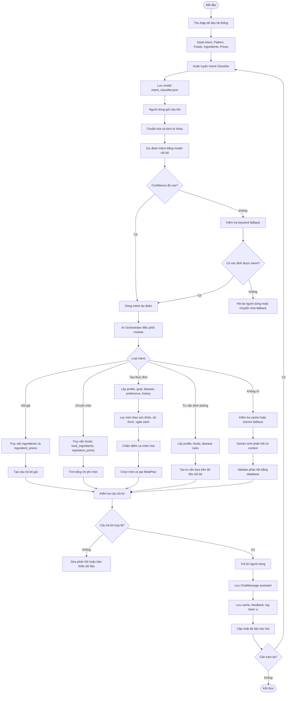

# FLOW AI HUẤN LUYỆN, HỌC HỎI, HIỂU VÀ TRẢ LỜI ĐÚNG CHO NGƯỜI DÙNG

## 1. Mục tiêu của flow

Flow này mô tả toàn bộ quá trình AI trong hệ thống Smart Home Chef từ lúc dữ liệu được đưa vào hệ thống, huấn luyện mô hình, học hỏi từ hành vi người dùng, hiểu câu hỏi, truy xuất dữ liệu nội bộ, tạo câu trả lời, kiểm tra độ đúng và tiếp tục cập nhật lại tri thức.

Mục tiêu chính của AI là:

```text
1. Hiểu người dùng đang hỏi gì.
2. Xác định câu hỏi thuộc loại nào.
3. Lấy đúng dữ liệu nội bộ cần dùng.
4. Cá nhân hóa theo hồ sơ người dùng.
5. Trả lời đúng, rõ ràng, không bịa dữ liệu.
6. Lưu lại lịch sử để cải thiện những lần trả lời sau.
```

---

## 2. Nguyên tắc hoạt động của AI

Hệ thống cần hoạt động theo 5 nguyên tắc chính:

```text
1. Database First:
   Ưu tiên dữ liệu nội bộ trước khi gọi AI bên ngoài.

2. Intent First:
   Trước khi trả lời, hệ thống phải hiểu câu hỏi thuộc ý định nào.

3. Context First:
   Câu trả lời phải dựa trên hồ sơ người dùng, bệnh lý, mục tiêu, sở thích,
   ngân sách, lịch sử ăn và dữ liệu món ăn.

4. Validate First:
   Kết quả AI sinh ra phải được kiểm tra lại bằng database trước khi trả lời.

5. Learn Continuously:
   Sau mỗi lần chat, hệ thống lưu log, intent, phản hồi, cache và feedback
   để cải thiện lần trả lời sau.
```

---

# 3. Flow tổng thể

```text
Dữ liệu hệ thống
    ↓
Seed dữ liệu ban đầu
    ↓
Huấn luyện intent classifier
    ↓
Người dùng gửi câu hỏi
    ↓
Tiền xử lý câu hỏi
    ↓
Phân loại ý định
    ↓
Điều phối sang module phù hợp
    ↓
Lấy dữ liệu nội bộ
    ↓
Cá nhân hóa theo người dùng
    ↓
Tạo câu trả lời
    ↓
Kiểm tra độ đúng
    ↓
Trả lời người dùng
    ↓
Lưu lịch sử, cache, feedback
    ↓
Cải thiện dữ liệu huấn luyện
```

---

# 4. Flow huấn luyện AI

## 4.1. Dữ liệu dùng để huấn luyện

AI nội bộ của hệ thống học từ các nguồn dữ liệu sau:

| Nguồn dữ liệu            | Vai trò                                  |
| ------------------------ | ---------------------------------------- |
| `Intent`                 | Danh sách ý định mà hệ thống có thể hiểu |
| `Pattern`                | Mẫu câu người dùng thường hỏi            |
| `MessageIntent`          | Tin nhắn đã được gán nhãn intent         |
| `ChatMessage`            | Lịch sử hội thoại thực tế                |
| `ModelMetadata`          | Lưu thông tin phiên bản model đã train   |
| `intent_classifier.json` | File lưu model sau huấn luyện            |

Ví dụ dữ liệu huấn luyện:

```text
Pattern: "lập thực đơn giảm cân"
Intent: meal_plan

Pattern: "giá ức gà bao nhiêu"
Intent: price_query

Pattern: "người tiểu đường nên ăn gì"
Intent: nutrition_advice

Pattern: "tạo danh sách mua nguyên liệu"
Intent: shopping_list
```

---

## 4.2. Flow huấn luyện chi tiết

```text
Bắt đầu huấn luyện
        ↓
Lấy danh sách Intent từ database
        ↓
Lấy Pattern đã gán với từng Intent
        ↓
Lấy MessageIntent từ lịch sử chat đã gán nhãn
        ↓
Gom dữ liệu thành tập huấn luyện
        ↓
Tiền xử lý văn bản
        ↓
Tách từ / token hóa câu hỏi
        ↓
Đếm tần suất token theo từng intent
        ↓
Tính xác suất xuất hiện của intent
        ↓
Tính xác suất token thuộc intent
        ↓
Tạo mô hình Naive Bayes nội bộ
        ↓
Lưu model thành intent_classifier.json
        ↓
Lưu metadata phiên bản model
        ↓
Kết thúc huấn luyện
```

---

## 4.3. Giải thích dễ hiểu

Khi train, hệ thống học kiểu:

```text
Các câu có từ "thực đơn", "menu", "7 ngày", "bữa sáng"
    → thường thuộc intent lập thực đơn.

Các câu có từ "giá", "bao nhiêu tiền", "chi phí", "ngân sách"
    → thường thuộc intent hỏi giá hoặc thực đơn theo ngân sách.

Các câu có từ "tiểu đường", "giảm cân", "calo", "protein"
    → thường thuộc intent tư vấn dinh dưỡng.

Các câu có từ "nguyên liệu", "mua gì", "shopping list"
    → thường thuộc intent danh sách mua nguyên liệu.
```

Từ đó, khi người dùng nhập câu mới, hệ thống so sánh câu mới với những mẫu đã học để dự đoán ý định.

---

# 5. Flow học hỏi từ người dùng

AI không chỉ học một lần, mà cần tiếp tục học từ quá trình sử dụng thực tế.

## 5.1. Dữ liệu học hỏi sau mỗi lần chat

Sau mỗi cuộc trò chuyện, hệ thống lưu:

| Dữ liệu                              | Mục đích                             |
| ------------------------------------ | ------------------------------------ |
| Câu hỏi người dùng                   | Làm dữ liệu học intent               |
| Intent dự đoán                       | Kiểm tra AI hiểu đúng hay sai        |
| Câu trả lời của AI                   | Dùng để đánh giá chất lượng phản hồi |
| Món ăn/thực đơn đã gợi ý             | Theo dõi đề xuất                     |
| Người dùng có chọn món không         | Học sở thích                         |
| Người dùng có sửa/xóa thực đơn không | Học mức độ phù hợp                   |
| Feedback/rating                      | Cải thiện chấm điểm                  |
| Cache phản hồi                       | Tránh gọi AI lặp lại                 |

---

## 5.2. Flow học hỏi

```text
Người dùng gửi câu hỏi
        ↓
Hệ thống dự đoán intent
        ↓
Hệ thống trả lời
        ↓
Lưu câu hỏi + intent + câu trả lời
        ↓
Người dùng tương tác tiếp:
- xem món
- chọn món
- lưu thực đơn
- xóa món
- đánh giá món
- hỏi lại câu khác
        ↓
Lưu hành vi người dùng
        ↓
Cập nhật hồ sơ sở thích
        ↓
Cập nhật dữ liệu huấn luyện
        ↓
Train lại intent classifier theo lịch hoặc thủ công
        ↓
AI hiểu tốt hơn ở lần sau
```

---

# 6. Flow hiểu câu hỏi người dùng

## 6.1. Mục tiêu

Khi người dùng nhập câu hỏi, AI phải hiểu được:

```text
1. Người dùng đang hỏi gì?
2. Câu hỏi thuộc intent nào?
3. Có nhắc đến món ăn không?
4. Có nhắc đến nguyên liệu không?
5. Có nhắc đến giá hoặc ngân sách không?
6. Có nhắc đến bệnh lý không?
7. Có nhắc đến mục tiêu sức khỏe không?
8. Có yêu cầu tạo thực đơn không?
9. Có thiếu thông tin quan trọng không?
```

---

## 6.2. Flow hiểu câu hỏi

```text
Người dùng nhập câu hỏi
        ↓
Chuẩn hóa văn bản
        ↓
Tách từ khóa quan trọng
        ↓
Dự đoán intent bằng model nội bộ
        ↓
Tính confidence
        ↓
Confidence đủ cao?
        ├── Có
        │     ↓
        │ Dùng intent dự đoán
        │
        └── Không
              ↓
        Kiểm tra keyword fallback
              ↓
        Vẫn không rõ?
              ├── Có → hỏi lại người dùng
              └── Không → dùng intent fallback
```

---

## 6.3. Ví dụ hiểu câu hỏi

### Ví dụ 1

```text
User: "Lập thực đơn giảm cân 7 ngày với 500k"
```

Hệ thống hiểu:

```text
Intent: BUDGET_MEAL_PLAN
Mục tiêu: giảm cân
Thời gian: 7 ngày
Ngân sách: 500.000đ
Cần dữ liệu:
- hồ sơ người dùng
- món ăn
- nguyên liệu
- giá nguyên liệu
- dinh dưỡng
```

---

### Ví dụ 2

```text
User: "Giá ức gà bao nhiêu?"
```

Hệ thống hiểu:

```text
Intent: PRICE_QUERY
Đối tượng: ức gà
Cần dữ liệu:
- ingredients
- ingredient_prices
Nguồn trả lời:
- database
Không được tự đoán giá
```

---

### Ví dụ 3

```text
User: "Tôi bị tiểu đường nên ăn món nào?"
```

Hệ thống hiểu:

```text
Intent: HEALTH_RECOMMENDATION
Bệnh lý: tiểu đường
Cần dữ liệu:
- user profile
- disease rules
- foods
- is_diabetes_friendly
- dinh dưỡng món ăn
```

---

# 7. Flow điều phối AI

Sau khi hiểu intent, hệ thống cần quyết định chuyển câu hỏi sang module nào.

## 7.1. Bảng điều phối

| Intent              | Module xử lý chính                   | Nguồn dữ liệu                                    |
| ------------------- | ------------------------------------ | ------------------------------------------------ |
| `PRICE_QUERY`       | IngredientPriceService               | `ingredients`, `ingredient_prices`               |
| `RECIPE_COST_QUERY` | RecipeCostService                    | `foods`, `food_ingredients`, `ingredient_prices` |
| `BUDGET_MEAL_PLAN`  | MealPlanGeneratorService             | `foods`, `ingredients`, `prices`, `profile`      |
| `GENERAL_MEAL_PLAN` | MealPlanGeneratorService             | `foods`, `profile`, `nutrition_logs`             |
| `NUTRITION_ADVICE`  | NutritionService / Gemini có context | `foods`, `profile`, `disease_rules`              |
| `RECIPE_GENERATION` | RecipeGeneratorService               | `ingredients`, `foods`, Gemini fallback          |
| `SHOPPING_LIST`     | ShoppingListService                  | `meal_plans`, `food_ingredients`, `prices`       |
| `UNKNOWN`           | Chat fallback                        | cache, Gemini, system context                    |

---

## 7.2. Flow điều phối

```text
Đã có intent
        ↓
Kiểm tra intent thuộc nhóm nào
        ↓
PRICE_QUERY?
        ├── Có → IngredientPriceService
        └── Không
              ↓
BUDGET_MEAL_PLAN?
        ├── Có → MealPlanGeneratorService + Budget Filter
        └── Không
              ↓
GENERAL_MEAL_PLAN?
        ├── Có → MealPlanGeneratorService
        └── Không
              ↓
NUTRITION_ADVICE?
        ├── Có → Nutrition + Profile + Disease Rules
        └── Không
              ↓
RECIPE_GENERATION?
        ├── Có → Recipe Generator + Ingredient Validator
        └── Không
              ↓
UNKNOWN?
        └── Cache / Gemini fallback
```

---

# 8. Flow lấy dữ liệu để trả lời đúng

Trước khi trả lời, hệ thống phải lấy dữ liệu cần thiết từ database.

## 8.1. Nếu hỏi giá

```text
Lấy tên nguyên liệu
        ↓
Tìm trong ingredients
        ↓
Lấy giá từ ingredient_prices
        ↓
Lấy đơn vị giá
        ↓
Lấy nguồn dữ liệu
        ↓
Trả lời giá
```

---

## 8.2. Nếu hỏi chi phí món

```text
Lấy tên món
        ↓
Tìm trong foods
        ↓
Lấy food_ingredients
        ↓
Với từng nguyên liệu:
    lấy giá từ ingredient_prices
    quy đổi đơn vị
    tính chi phí
        ↓
Cộng tổng chi phí món
        ↓
Trả chi phí món và chi phí mỗi khẩu phần
```

---

## 8.3. Nếu tạo thực đơn

```text
Lấy hồ sơ người dùng
        ↓
Lấy mục tiêu sức khỏe
        ↓
Lấy bệnh lý / dị ứng
        ↓
Lấy sở thích / món cần tránh
        ↓
Lấy lịch sử ăn gần đây
        ↓
Lấy danh sách món ăn trong foods
        ↓
Lấy nguyên liệu và giá của từng món
        ↓
Tính dinh dưỡng và chi phí
        ↓
Lọc món không phù hợp
        ↓
Chọn món tốt nhất
```

---

# 9. Flow cá nhân hóa trước khi trả lời

Cá nhân hóa giúp câu trả lời không chung chung.

## 9.1. Các yếu tố cá nhân hóa

| Yếu tố            | Cách dùng                             |
| ----------------- | ------------------------------------- |
| Mục tiêu sức khỏe | giảm cân, tăng cân, duy trì           |
| Bệnh lý           | tiểu đường, huyết áp, mỡ máu          |
| Dị ứng            | loại bỏ món có nguyên liệu gây dị ứng |
| Sở thích          | ưu tiên món người dùng thích          |
| Món cần tránh     | loại bỏ món không ăn                  |
| Ngân sách         | chọn món vừa tiền                     |
| Lịch sử ăn        | tránh lặp món                         |
| Feedback          | ưu tiên món từng được đánh giá tốt    |

---

## 9.2. Flow cá nhân hóa

```text
Danh sách món ứng viên
        ↓
Lọc điều kiện bắt buộc:
- bệnh lý
- dị ứng
- món cần tránh
- ngân sách
        ↓
Chấm điểm từng món:
- phù hợp dinh dưỡng
- phù hợp mục tiêu
- phù hợp sở thích
- phù hợp ngân sách
- tránh lặp món
- dữ liệu đầy đủ
        ↓
Sắp xếp món theo điểm
        ↓
Chọn món phù hợp nhất
        ↓
Tạo phản hồi cá nhân hóa
```

---

# 10. Flow tạo câu trả lời

## 10.1. Cấu trúc câu trả lời chuẩn

Một câu trả lời đúng nên có cấu trúc:

```text
1. Xác nhận yêu cầu người dùng.
2. Nêu dữ liệu hệ thống đã dùng.
3. Trả kết quả chính.
4. Giải thích ngắn gọn lý do.
5. Nêu chi phí / dinh dưỡng nếu có.
6. Cảnh báo nếu thiếu dữ liệu.
7. Gợi ý bước tiếp theo hoặc link xem chi tiết.
```

---

## 10.2. Flow tạo câu trả lời

```text
Nhận kết quả từ module xử lý
        ↓
Kiểm tra kết quả có dữ liệu không
        ↓
Có dữ liệu?
        ├── Có
        │     ↓
        │ Tạo câu trả lời dựa trên dữ liệu DB
        │     ↓
        │ Thêm giải thích cá nhân hóa
        │     ↓
        │ Thêm giá / dinh dưỡng / lý do chọn
        │     ↓
        │ Trả lời người dùng
        │
        └── Không
              ↓
        Kiểm tra có thể fallback Gemini không
              ↓
        Gemini sinh gợi ý
              ↓
        Validate lại bằng database
              ↓
        Hợp lệ?
              ├── Có → trả lời có kiểm chứng
              └── Không → báo không đủ dữ liệu
```

---

# 11. Flow kiểm tra câu trả lời trước khi gửi

Trước khi gửi cho người dùng, hệ thống cần kiểm tra:

```text
1. Có đúng intent không?
2. Có lấy dữ liệu từ database không?
3. Nếu là giá, giá có trong ingredient_prices không?
4. Nếu là thực đơn theo ngân sách, tổng tiền có vượt ngân sách không?
5. Nếu là bệnh lý, món có vi phạm rule bệnh lý không?
6. Nếu là dị ứng, món có chứa nguyên liệu dị ứng không?
7. Nếu Gemini sinh món mới, nguyên liệu có tồn tại trong database không?
8. Câu trả lời có rõ ràng, dễ hiểu không?
```

Flow kiểm tra:

```text
Câu trả lời nháp
        ↓
Kiểm tra dữ liệu nguồn
        ↓
Kiểm tra luật sức khỏe
        ↓
Kiểm tra ngân sách
        ↓
Kiểm tra giá nguyên liệu
        ↓
Kiểm tra món bị tránh / dị ứng
        ↓
Có lỗi?
        ├── Có → sửa / tạo lại / báo thiếu dữ liệu
        └── Không → gửi cho người dùng
```

---

# 12. Flow lưu phản hồi và học lại

Sau khi trả lời, hệ thống không kết thúc ngay mà cần lưu lại để học.

```text
Trả lời người dùng
        ↓
Lưu ChatMessage của assistant
        ↓
Lưu intent đã dự đoán
        ↓
Lưu cache câu trả lời nếu hợp lệ
        ↓
Nếu có thực đơn:
    lưu MealPlan
    lưu món đã chọn
    lưu chi phí
        ↓
Nếu người dùng đánh giá:
    lưu UserFeedback
        ↓
Nếu người dùng sửa/xóa món:
    lưu hành vi không phù hợp
        ↓
Cập nhật UserPreferenceProfile
        ↓
Bổ sung dữ liệu MessageIntent nếu cần
        ↓
Train lại intent classifier theo lịch
```

---

# 13. Flow Mermaid tổng thể



---

# 14. Pseudocode tổng thể

```python
def handle_ai_message(user, message):
    # 1. Lưu câu hỏi người dùng
    user_message = save_chat_message(user, role="user", content=message)

    # 2. Chuẩn hóa câu hỏi
    normalized_text = normalize_text(message)

    # 3. Phân loại ý định
    intent_result = predict_intent(normalized_text)

    if intent_result.confidence < 0.35:
        intent = keyword_fallback(normalized_text)
    else:
        intent = intent_result.intent_name

    # 4. Nếu vẫn không hiểu rõ
    if not intent:
        return ask_clarifying_question(user_message)

    # 5. Điều phối theo intent
    if intent == "PRICE_QUERY":
        result = handle_price_query(user, normalized_text)

    elif intent == "RECIPE_COST_QUERY":
        result = handle_recipe_cost_query(user, normalized_text)

    elif intent == "BUDGET_MEAL_PLAN":
        result = generate_budget_meal_plan(user, normalized_text)

    elif intent == "GENERAL_MEAL_PLAN":
        result = generate_general_meal_plan(user, normalized_text)

    elif intent == "NUTRITION_ADVICE":
        result = generate_nutrition_advice(user, normalized_text)

    else:
        result = generate_chat_response_with_context(user, normalized_text)

    # 6. Kiểm tra kết quả trước khi trả lời
    checked_result = validate_ai_result(result, user, intent)

    if not checked_result.is_valid:
        response = build_safe_error_response(checked_result)
    else:
        response = build_final_answer(checked_result)

    # 7. Lưu phản hồi
    save_chat_message(user, role="assistant", content=response)

    # 8. Lưu cache và log học hỏi
    save_response_cache_if_valid(normalized_text, response)
    save_ai_learning_log(user, message, intent, response)

    return response
```

---

# 15. Flow trả lời đúng theo từng loại câu hỏi

## 15.1. Người dùng hỏi giá

```text
User: "Giá ức gà bao nhiêu?"
```

AI xử lý:

```text
1. Nhận diện intent = PRICE_QUERY.
2. Trích xuất nguyên liệu = ức gà.
3. Tìm trong bảng ingredients.
4. Lấy giá từ ingredient_prices.
5. Trả lời giá, đơn vị, nguồn dữ liệu.
```

Câu trả lời chuẩn:

```text
Giá ức gà hiện có trong hệ thống là khoảng ... đ/kg.
Dữ liệu giá được lấy từ bảng nguyên liệu của hệ thống.
Hệ thống sẽ dùng mức giá này khi tính chi phí món ăn hoặc lập thực đơn theo ngân sách.
```

---

## 15.2. Người dùng yêu cầu lập thực đơn theo ngân sách

```text
User: "Lập thực đơn 7 ngày với 500k"
```

AI xử lý:

```text
1. Nhận diện intent = BUDGET_MEAL_PLAN.
2. Trích xuất ngân sách = 500.000đ.
3. Trích xuất số ngày = 7.
4. Tính ngân sách mỗi ngày.
5. Lấy hồ sơ người dùng.
6. Lấy bệnh lý, mục tiêu, sở thích.
7. Query món ăn từ database.
8. Tính chi phí từng món từ nguyên liệu.
9. Lọc món vượt ngân sách.
10. Chấm điểm cá nhân hóa.
11. Chọn món cho từng bữa.
12. Tạo thực đơn và danh sách mua nguyên liệu.
13. Trả kết quả có tổng chi phí.
```

Câu trả lời chuẩn:

```text
Mình đã tạo thực đơn 7 ngày trong ngân sách 500.000đ.

Ngân sách trung bình mỗi ngày: khoảng 71.400đ.
Tổng chi phí dự kiến của thực đơn: ... đ.
Ngân sách còn lại: ... đ.

Thực đơn được chọn dựa trên:
- dữ liệu giá nguyên liệu trong database
- hồ sơ sức khỏe của bạn
- mục tiêu dinh dưỡng
- lịch sử ăn gần đây
- độ đa dạng món ăn
```

---

## 15.3. Người dùng hỏi tư vấn dinh dưỡng

```text
User: "Tôi bị tiểu đường nên ăn món nào?"
```

AI xử lý:

```text
1. Nhận diện intent = NUTRITION_ADVICE.
2. Xác định bệnh lý = tiểu đường.
3. Lấy profile người dùng.
4. Tìm các món is_diabetes_friendly = True.
5. Lọc món nhiều đường, nhiều carb nhanh.
6. Chấm điểm cá nhân hóa.
7. Trả danh sách món phù hợp.
```

Câu trả lời chuẩn:

```text
Với tình trạng tiểu đường, hệ thống ưu tiên các món có chỉ số đường thấp,
giàu chất xơ, protein vừa đủ và hạn chế tinh bột hấp thụ nhanh.

Một số món phù hợp trong hệ thống:
1. ...
2. ...
3. ...

Các món này được chọn dựa trên dữ liệu dinh dưỡng và hồ sơ sức khỏe của bạn.
```

---

# 16. Mô tả ngắn gọn để đưa vào báo cáo

Quy trình AI của hệ thống Smart Home Chef được xây dựng theo hướng học hỏi liên tục. Ban đầu, hệ thống thu thập dữ liệu từ các bảng Intent, Pattern và MessageIntent để huấn luyện bộ phân loại ý định bằng mô hình Naive Bayes nội bộ. Khi người dùng gửi câu hỏi, hệ thống chuẩn hóa văn bản, dự đoán intent, kiểm tra độ tin cậy và dùng cơ chế fallback bằng keyword nếu model chưa đủ chắc chắn. Sau khi hiểu ý định, AI Orchestrator điều phối yêu cầu sang module phù hợp như hỏi giá nguyên liệu, tính chi phí món ăn, lập thực đơn, tư vấn dinh dưỡng hoặc trả lời chat thông thường.

Đối với các câu hỏi cần dữ liệu chính xác, hệ thống ưu tiên truy xuất database trước. Ví dụ, câu hỏi về giá sẽ lấy dữ liệu từ bảng nguyên liệu và bảng giá nguyên liệu; yêu cầu lập thực đơn sẽ lấy hồ sơ người dùng, mục tiêu sức khỏe, bệnh lý, sở thích, lịch sử ăn uống, món ăn, nguyên liệu và giá để lọc, chấm điểm và chọn món phù hợp. Nếu dữ liệu nội bộ chưa đủ, Gemini có thể được dùng để sinh gợi ý, nhưng kết quả phải được kiểm tra lại bằng database trước khi trả lời. Sau khi phản hồi, hệ thống lưu lại tin nhắn, intent, cache, feedback và hành vi người dùng để cải thiện cá nhân hóa và bổ sung dữ liệu huấn luyện cho các lần sau.

---

# 17. Kết luận

Flow AI trả lời người dùng gồm 6 vòng chính:

```text
1. Huấn luyện:
   học intent từ Pattern, MessageIntent và lịch sử chat.

2. Hiểu:
   phân tích câu hỏi, dự đoán intent, trích xuất thông tin quan trọng.

3. Điều phối:
   chuyển câu hỏi sang đúng module xử lý.

4. Truy xuất:
   lấy dữ liệu từ database như món ăn, nguyên liệu, giá, hồ sơ người dùng.

5. Trả lời:
   tạo câu trả lời dựa trên dữ liệu thật và cá nhân hóa.

6. Học lại:
   lưu log, feedback, cache và cập nhật dữ liệu huấn luyện.
```

Điểm quan trọng nhất là AI không chỉ sinh câu trả lời bằng ngôn ngữ tự nhiên, mà phải trả lời dựa trên dữ liệu nội bộ đã kiểm chứng. Với các câu hỏi về giá, ngân sách và thực đơn, hệ thống bắt buộc sử dụng database làm nguồn quyết định. AI chỉ hỗ trợ hiểu câu hỏi, điều phối, diễn giải và cá nhân hóa câu trả lời.
