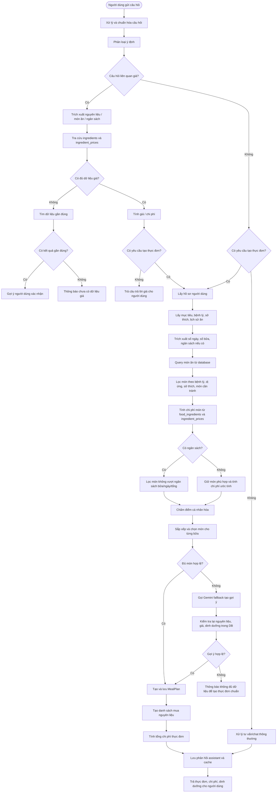

# FLOW XỬ LÝ CÂU HỎI GIÁ CẢ VÀ TẠO THỰC ĐƠN THEO NGÂN SÁCH

## 1. Nguyên tắc xử lý chính

Hệ thống Smart Home Chef phải xử lý theo nguyên tắc **Database First**. Nghĩa là khi người dùng hỏi về giá thực phẩm, chi phí nguyên liệu hoặc yêu cầu lập thực đơn theo ngân sách, hệ thống bắt buộc phải lấy dữ liệu từ các bảng nguyên liệu và giá trong cơ sở dữ liệu trước. AI hoặc Gemini chỉ được dùng để diễn giải câu trả lời, không được tự đoán giá.

Nguyên tắc bắt buộc:

```text
1. Giá nguyên liệu phải lấy từ bảng IngredientPrice.
2. Tên nguyên liệu phải đối chiếu với bảng Ingredient.
3. Nếu món ăn có công thức, chi phí món phải tính từ FoodIngredient + IngredientPrice.
4. Nếu người dùng có ngân sách, hệ thống phải lọc món sao cho tổng chi phí không vượt ngân sách.
5. Nếu không có ngân sách, hệ thống vẫn nên tính chi phí ước tính để người dùng biết.
6. Nếu dùng Gemini fallback, kết quả Gemini phải được kiểm tra lại với database.
7. Không cho phép AI tự bịa giá nguyên liệu ngoài database.
```

---

## 2. Các bảng dữ liệu sử dụng

| Bảng                | Vai trò                                      |
| ------------------- | -------------------------------------------- |
| `ingredients`       | Lưu danh sách nguyên liệu                    |
| `ingredient_prices` | Lưu giá nguyên liệu đã crawl từ WinMart      |
| `unit_conversions`  | Quy đổi đơn vị như g, kg, ml, l, quả, bó     |
| `foods`             | Lưu món ăn / thực phẩm / công thức           |
| `food_ingredients`  | Liên kết món ăn với nguyên liệu              |
| `food_recipes`      | Lưu cách nấu / hướng dẫn chế biến            |
| `user_profiles`     | Lưu mục tiêu sức khỏe, bệnh lý, ngân sách    |
| `user_diseases`     | Lưu bệnh lý của người dùng                   |
| `user_goals`        | Lưu mục tiêu như giảm cân, tăng cân, duy trì |
| `nutrition_logs`    | Lưu lịch sử ăn uống gần đây                  |
| `meal_plans`        | Lưu thực đơn đã tạo                          |

---

## 3. Flow tổng quát

```text
Người dùng nhập câu hỏi
        ↓
Tiền xử lý câu hỏi
        ↓
Phân loại ý định
        ↓
Câu hỏi liên quan giá?
        ├── Có → Luồng hỏi giá / tính chi phí
        └── Không
              ↓
        Câu hỏi yêu cầu tạo thực đơn?
              ├── Có → Luồng tạo thực đơn
              └── Không → Luồng chat/tư vấn thông thường
```

---

## 4. Flow phân loại ý định

Khi người dùng gửi câu hỏi, hệ thống cần xác định câu hỏi thuộc nhóm nào.

Các nhóm intent chính:

| Intent                    | Ví dụ câu hỏi                           |
| ------------------------- | --------------------------------------- |
| `PRICE_QUERY`             | “Giá ức gà bao nhiêu?”                  |
| `INGREDIENT_COST_QUERY`   | “Mua rau cải và thịt bò hết bao nhiêu?” |
| `RECIPE_COST_QUERY`       | “Món gà xào nấm tốn bao nhiêu tiền?”    |
| `BUDGET_MEAL_PLAN`        | “Lập thực đơn 7 ngày với 500k”          |
| `GENERAL_MEAL_PLAN`       | “Lập thực đơn giảm cân cho tôi”         |
| `SHOPPING_LIST_BY_BUDGET` | “100k mua được những nguyên liệu gì?”   |
| `NUTRITION_ADVICE`        | “Người tiểu đường nên ăn gì?”           |

Quy trình phân loại:

```text
Bước 1: Nhận câu hỏi người dùng
        ↓
Bước 2: Chuẩn hóa chữ thường, bỏ dấu câu không cần thiết
        ↓
Bước 3: Kiểm tra keyword giá:
        "giá", "bao nhiêu tiền", "chi phí", "tốn bao nhiêu",
        "ngân sách", "budget", "rẻ", "đắt", "mua được"
        ↓
Bước 4: Kiểm tra keyword thực đơn:
        "thực đơn", "menu", "lập thực đơn", "ăn gì",
        "bữa sáng", "bữa trưa", "bữa tối", "7 ngày", "tuần"
        ↓
Bước 5: Nếu có cả keyword giá và thực đơn
        → intent = BUDGET_MEAL_PLAN
        ↓
Bước 6: Nếu chỉ hỏi giá nguyên liệu
        → intent = PRICE_QUERY
        ↓
Bước 7: Nếu hỏi chi phí một món
        → intent = RECIPE_COST_QUERY
        ↓
Bước 8: Nếu chỉ yêu cầu lập thực đơn
        → intent = GENERAL_MEAL_PLAN
        ↓
Bước 9: Nếu không rõ
        → chuyển sang AI Orchestrator hoặc hỏi lại người dùng
```

---

# 5. Flow xử lý câu hỏi liên quan đến giá nguyên liệu

## 5.1. Trường hợp người dùng hỏi giá một nguyên liệu

Ví dụ:

```text
"Giá ức gà bao nhiêu?"
"Thịt bò hôm nay bao nhiêu tiền?"
"Rau cải WinMart giá bao nhiêu?"
```

Flow xử lý:

```text
Người dùng hỏi giá nguyên liệu
        ↓
Phát hiện intent = PRICE_QUERY
        ↓
Trích xuất tên nguyên liệu từ câu hỏi
        ↓
Chuẩn hóa tên nguyên liệu
        ↓
Tìm nguyên liệu trong bảng ingredients
        ↓
Tìm giá trong bảng ingredient_prices
        ↓
Có giá?
        ├── Có
        │     ↓
        │ Trả giá, đơn vị, nguồn, thời gian cập nhật
        │
        └── Không
              ↓
        Tìm nguyên liệu gần giống
              ↓
        Có nguyên liệu gần giống?
              ├── Có → Gợi ý người dùng chọn lại
              └── Không → Báo chưa có dữ liệu giá
```

Câu trả lời mẫu:

```text
Giá ức gà hiện có trong cơ sở dữ liệu là khoảng 89.000đ/kg.
Nguồn dữ liệu: WinMart.
Hệ thống sẽ dùng mức giá này để tính chi phí nếu bạn yêu cầu lập thực đơn hoặc tạo danh sách mua nguyên liệu.
```

---

## 5.2. Trường hợp người dùng hỏi tổng tiền nhiều nguyên liệu

Ví dụ:

```text
"Mua 500g thịt bò, 1kg rau cải và 10 quả trứng hết bao nhiêu?"
```

Flow xử lý:

```text
Người dùng hỏi tổng tiền nhiều nguyên liệu
        ↓
Phát hiện intent = INGREDIENT_COST_QUERY
        ↓
Tách danh sách nguyên liệu:
- thịt bò: 500g
- rau cải: 1kg
- trứng: 10 quả
        ↓
Chuẩn hóa đơn vị
        ↓
Tìm từng nguyên liệu trong ingredients
        ↓
Lấy giá từng nguyên liệu từ ingredient_prices
        ↓
Quy đổi đơn vị bằng unit_conversions
        ↓
Tính tiền từng nguyên liệu
        ↓
Cộng tổng chi phí
        ↓
Trả bảng chi phí chi tiết cho người dùng
```

Công thức tính:

```text
Chi phí nguyên liệu =
Số lượng sau quy đổi × Giá theo đơn vị chuẩn
```

Ví dụ:

```text
Thịt bò: 0.5kg × 250.000đ/kg = 125.000đ
Rau cải: 1kg × 30.000đ/kg = 30.000đ
Trứng: 10 quả × 3.000đ/quả = 30.000đ

Tổng chi phí ước tính: 185.000đ
```

---

# 6. Flow xử lý câu hỏi chi phí món ăn

Ví dụ:

```text
"Món gà xào nấm tốn bao nhiêu tiền?"
"Nấu canh bí đỏ cho 2 người hết khoảng bao nhiêu?"
```

Flow xử lý:

```text
Người dùng hỏi chi phí món ăn
        ↓
Phát hiện intent = RECIPE_COST_QUERY
        ↓
Trích xuất tên món ăn
        ↓
Tìm món trong bảng foods
        ↓
Có món trong database?
        ├── Có
        │     ↓
        │ Lấy danh sách nguyên liệu từ food_ingredients
        │     ↓
        │ Lấy giá từng nguyên liệu từ ingredient_prices
        │     ↓
        │ Quy đổi số lượng nguyên liệu
        │     ↓
        │ Tính tổng chi phí món ăn
        │     ↓
        │ Trả chi phí theo khẩu phần
        │
        └── Không
              ↓
        Tìm món gần giống
              ↓
        Nếu không có món gần giống:
        dùng Gemini gợi ý công thức tạm thời
              ↓
        Nhưng bắt buộc kiểm tra nguyên liệu có trong database
              ↓
        Nếu nguyên liệu không có giá → không tính bừa
```

Cách trả lời chuẩn:

```text
Món gà xào nấm có chi phí ước tính khoảng 62.000đ cho 2 khẩu phần.

Chi tiết:
- Ức gà: 300g × 89.000đ/kg = 26.700đ
- Nấm: 200g × 75.000đ/kg = 15.000đ
- Hành, tỏi, gia vị: khoảng 20.000đ

Tổng: khoảng 61.700đ
Chi phí mỗi khẩu phần: khoảng 30.850đ
```

---

# 7. Flow tạo thực đơn không theo ngân sách

Ví dụ:

```text
"Lập thực đơn giảm cân 7 ngày cho tôi"
"Lập thực đơn cho người tiểu đường"
"Lên thực đơn hôm nay"
```

Flow xử lý:

```text
Người dùng yêu cầu tạo thực đơn
        ↓
Phát hiện intent = GENERAL_MEAL_PLAN
        ↓
Lấy hồ sơ người dùng
        ↓
Lấy mục tiêu sức khỏe
        ↓
Lấy bệnh lý / dị ứng / món cần tránh
        ↓
Lấy lịch sử ăn gần đây
        ↓
Xác định số ngày cần tạo thực đơn
        ↓
Xác định số bữa mỗi ngày
        ↓
Tính mục tiêu dinh dưỡng
        ↓
Query món ăn từ database
        ↓
Lọc món không phù hợp:
- không phù hợp bệnh lý
- trùng dị ứng
- trùng món cần tránh
- đã ăn quá gần đây
        ↓
Chấm điểm cá nhân hóa:
- phù hợp calories
- phù hợp protein/carb/fat
- phù hợp mục tiêu
- phù hợp sở thích
- đa dạng món
        ↓
Tính thêm chi phí từng món từ ingredient_prices
        ↓
Sắp xếp món theo điểm phù hợp
        ↓
Chọn món cho từng bữa
        ↓
Tạo MealPlan
        ↓
Lưu vào database
        ↓
Trả thực đơn + dinh dưỡng + chi phí ước tính
```

Điểm quan trọng: dù người dùng không đưa ngân sách, hệ thống vẫn nên trả thêm chi phí ước tính để tăng độ tin cậy.

Câu trả lời mẫu:

```text
Mình đã tạo thực đơn giảm cân 7 ngày dựa trên hồ sơ sức khỏe của bạn.

Tổng năng lượng trung bình mỗi ngày: khoảng 1.600 kcal.
Chi phí ước tính mỗi ngày: khoảng 85.000đ - 110.000đ.
Dữ liệu giá được tính từ bảng nguyên liệu trong hệ thống.

Bạn có thể xem chi tiết thực đơn tại trang Thực đơn.
```

---

# 8. Flow tạo thực đơn theo ngân sách

Ví dụ:

```text
"Lập thực đơn 7 ngày với 500k"
"Làm thực đơn giảm cân 100k/ngày"
"Cho tôi thực đơn 3 ngày dưới 300 nghìn"
"500k ăn trong 1 tuần được không?"
```

Đây là flow quan trọng nhất vì hệ thống phải kết hợp cả **dinh dưỡng + cá nhân hóa + giá nguyên liệu**.

## 8.1. Flow tổng quát

```text
Người dùng yêu cầu thực đơn theo ngân sách
        ↓
Phát hiện intent = BUDGET_MEAL_PLAN
        ↓
Trích xuất ngân sách:
- 500k
- 100k/ngày
- dưới 300 nghìn
        ↓
Trích xuất thời gian:
- 1 ngày
- 3 ngày
- 7 ngày
- 1 tuần
        ↓
Xác định ngân sách tổng hoặc ngân sách mỗi ngày
        ↓
Lấy hồ sơ người dùng
        ↓
Lấy bệnh lý, mục tiêu, sở thích, dị ứng
        ↓
Tính mục tiêu dinh dưỡng mỗi ngày
        ↓
Query món ăn từ database
        ↓
Lọc món theo điều kiện bắt buộc
        ↓
Tính chi phí từng món từ nguyên liệu
        ↓
Loại món vượt ngân sách bữa/ngày
        ↓
Chấm điểm cá nhân hóa
        ↓
Tối ưu chọn món sao cho:
- không vượt ngân sách
- đủ bữa
- đủ dinh dưỡng tương đối
- không lặp món quá nhiều
        ↓
Tạo thực đơn
        ↓
Tính tổng chi phí toàn thực đơn
        ↓
Tạo danh sách mua nguyên liệu
        ↓
Lưu MealPlan
        ↓
Trả kết quả cho người dùng
```

---

## 8.2. Cách chia ngân sách

Nếu người dùng nhập:

```text
"Lập thực đơn 7 ngày với 500k"
```

Hệ thống tính:

```text
Ngân sách tổng = 500.000đ
Số ngày = 7
Ngân sách mỗi ngày = 500.000 / 7 ≈ 71.400đ/ngày
```

Sau đó chia theo bữa:

```text
Bữa sáng: 25%
Bữa trưa: 35%
Bữa tối: 35%
Bữa phụ: 5%
```

Ví dụ:

```text
Ngân sách ngày: 71.400đ

Bữa sáng: khoảng 17.850đ
Bữa trưa: khoảng 24.990đ
Bữa tối: khoảng 24.990đ
Bữa phụ: khoảng 3.570đ
```

Nếu người dùng nhập:

```text
"Lập thực đơn 100k/ngày"
```

Hệ thống hiểu:

```text
Ngân sách mỗi ngày = 100.000đ
Nếu không nói số ngày → mặc định 1 ngày hoặc theo cấu hình hệ thống
```

---

## 8.3. Cách tính chi phí món ăn trong thực đơn

Với mỗi món candidate:

```text
Chi phí món =
Tổng chi phí tất cả nguyên liệu của món
```

Chi tiết:

```text
For each food:
    total_cost = 0

    For each ingredient in food_ingredients:
        ingredient_price = get_price(ingredient)
        converted_quantity = convert_unit(quantity, unit)
        ingredient_cost = converted_quantity × ingredient_price
        total_cost += ingredient_cost

    food.estimated_cost = total_cost
```

Nếu món không có đủ giá nguyên liệu:

```text
Nếu thiếu giá nguyên liệu phụ:
    vẫn có thể giữ món nhưng đánh dấu "chi phí chưa đầy đủ"

Nếu thiếu giá nguyên liệu chính:
    loại khỏi thực đơn theo ngân sách

Nếu người dùng yêu cầu tính chính xác:
    chỉ dùng món có đủ giá nguyên liệu
```

---

## 8.4. Điều kiện lọc bắt buộc

Trước khi chấm điểm, hệ thống phải loại các món không hợp lệ.

```text
Hard Filter:
1. Loại món gây dị ứng
2. Loại món người dùng không ăn
3. Loại món không phù hợp bệnh lý
4. Loại món vượt ngân sách bữa nếu đang lập thực đơn theo ngân sách
5. Loại món thiếu giá nguyên liệu chính
6. Loại món thiếu dữ liệu dinh dưỡng nghiêm trọng
```

Ví dụ:

```text
Nếu user bị tiểu đường:
    chỉ ưu tiên món is_diabetes_friendly = True

Nếu user giảm cân:
    ưu tiên món is_weight_loss_friendly = True
    hạn chế món calories cao

Nếu user có ngân sách 20.000đ/bữa:
    loại món estimated_cost > 20.000đ
```

---

## 8.5. Chấm điểm sau khi lọc

Sau khi lọc điều kiện bắt buộc, hệ thống chấm điểm món:

```text
score =
điểm dinh dưỡng
+ điểm phù hợp mục tiêu
+ điểm phù hợp sở thích
+ điểm phù hợp bệnh lý
+ điểm phù hợp ngân sách
+ điểm đa dạng
+ điểm lịch sử ăn uống
+ điểm chất lượng dữ liệu
```

Gợi ý công thức điểm:

```text
score = 
0.25 * nutrition_fit
+ 0.20 * health_fit
+ 0.15 * preference_fit
+ 0.15 * budget_fit
+ 0.10 * variety_score
+ 0.10 * history_score
+ 0.05 * data_quality
```

Trong đó:

| Thành phần       | Ý nghĩa                                                 |
| ---------------- | ------------------------------------------------------- |
| `nutrition_fit`  | Món có phù hợp mục tiêu calories/protein/carb/fat không |
| `health_fit`     | Có phù hợp bệnh lý không                                |
| `preference_fit` | Có khớp sở thích người dùng không                       |
| `budget_fit`     | Có nằm trong ngân sách không                            |
| `variety_score`  | Có giúp thực đơn đa dạng không                          |
| `history_score`  | Có tránh lặp món đã ăn gần đây không                    |
| `data_quality`   | Món có đủ dữ liệu dinh dưỡng và giá không               |

---

# 9. Flow tạo danh sách mua nguyên liệu

Khi thực đơn đã được tạo, hệ thống nên tự động gom nguyên liệu thành danh sách mua.

Flow:

```text
MealPlan đã tạo
        ↓
Lấy tất cả món trong thực đơn
        ↓
Lấy food_ingredients của từng món
        ↓
Gom nguyên liệu trùng nhau
        ↓
Cộng tổng số lượng
        ↓
Lấy giá từng nguyên liệu
        ↓
Tính tổng tiền từng nguyên liệu
        ↓
Tạo Shopping List
        ↓
Trả danh sách mua cho người dùng
```

Ví dụ kết quả:

```text
Danh sách mua nguyên liệu cho 7 ngày:

1. Ức gà: 1.5kg × 89.000đ/kg = 133.500đ
2. Trứng gà: 20 quả × 3.000đ/quả = 60.000đ
3. Rau cải: 2kg × 30.000đ/kg = 60.000đ
4. Gạo lứt: 1kg × 45.000đ/kg = 45.000đ

Tổng chi phí dự kiến: 298.500đ
Ngân sách còn lại: 201.500đ
```

---

# 10. Flow trả lời người dùng

## 10.1. Nếu người dùng hỏi giá

Câu trả lời cần có:

```text
- Tên nguyên liệu
- Giá hiện tại
- Đơn vị
- Nguồn dữ liệu
- Thời gian cập nhật nếu có
- Gợi ý sử dụng nếu phù hợp
```

Mẫu:

```text
Giá ức gà hiện có trong hệ thống là khoảng 89.000đ/kg.
Dữ liệu được lấy từ bảng giá nguyên liệu đã crawl từ WinMart.

Nếu bạn muốn, hệ thống có thể dùng mức giá này để lập thực đơn theo ngân sách.
```

---

## 10.2. Nếu người dùng hỏi chi phí món

Câu trả lời cần có:

```text
- Tên món
- Số khẩu phần
- Danh sách nguyên liệu
- Chi phí từng nguyên liệu
- Tổng chi phí món
- Chi phí mỗi khẩu phần
```

Mẫu:

```text
Món gà xào nấm có chi phí ước tính khoảng 61.700đ cho 2 khẩu phần.

Chi tiết:
- Ức gà: 300g = 26.700đ
- Nấm: 200g = 15.000đ
- Hành, tỏi, gia vị: khoảng 20.000đ

Chi phí mỗi khẩu phần: khoảng 30.850đ.
```

---

## 10.3. Nếu người dùng yêu cầu thực đơn theo ngân sách

Câu trả lời cần có:

```text
- Ngân sách người dùng đưa ra
- Số ngày
- Ngân sách mỗi ngày
- Thực đơn từng ngày
- Dinh dưỡng ước tính
- Chi phí từng bữa
- Tổng chi phí
- Ngân sách còn lại hoặc vượt bao nhiêu
- Link xem thực đơn
```

Mẫu:

```text
Mình đã tạo thực đơn 7 ngày trong ngân sách 500.000đ.

Ngân sách trung bình mỗi ngày: khoảng 71.400đ.
Tổng chi phí thực đơn dự kiến: 486.000đ.
Ngân sách còn lại: 14.000đ.

Thực đơn đã ưu tiên:
- món có giá phù hợp
- nguyên liệu có sẵn trong database
- phù hợp mục tiêu sức khỏe
- không lặp món quá nhiều
- đảm bảo dinh dưỡng tương đối

Bạn có thể xem chi tiết tại trang Thực đơn.
```

---

## 10.4. Nếu người dùng yêu cầu thực đơn không có ngân sách

Câu trả lời cần có:

```text
- Thực đơn đã tạo
- Mục tiêu dinh dưỡng
- Lý do chọn món
- Chi phí ước tính
- Link xem thực đơn
```

Mẫu:

```text
Mình đã tạo thực đơn giảm cân 7 ngày cho bạn.

Thực đơn được chọn dựa trên:
- mục tiêu sức khỏe
- thông tin dinh dưỡng
- lịch sử ăn gần đây
- sở thích cá nhân
- dữ liệu giá nguyên liệu trong hệ thống

Chi phí ước tính trung bình mỗi ngày: 85.000đ - 110.000đ.
Bạn có thể xem chi tiết tại trang Thực đơn.
```

---

# 11. Flow xử lý khi dữ liệu không đủ

## 11.1. Thiếu giá nguyên liệu

```text
Nếu thiếu giá nguyên liệu phụ:
    trả lời có cảnh báo:
    "Chi phí có thể chưa hoàn toàn chính xác vì thiếu giá một số nguyên liệu phụ."

Nếu thiếu giá nguyên liệu chính:
    không dùng món đó cho thực đơn theo ngân sách.

Nếu người dùng chỉ hỏi giá:
    báo rõ:
    "Hiện hệ thống chưa có giá của nguyên liệu này trong database."
```

---

## 11.2. Thiếu món phù hợp trong database

```text
Nếu không đủ món phù hợp:
    gọi Gemini fallback để sinh gợi ý món mới
        ↓
    Kiểm tra lại nguyên liệu Gemini đưa ra có trong ingredients không
        ↓
    Kiểm tra lại giá nguyên liệu có trong ingredient_prices không
        ↓
    Kiểm tra lại dinh dưỡng
        ↓
    Nếu hợp lệ → dùng món
    Nếu không hợp lệ → không đưa vào thực đơn
```

Nguyên tắc:

```text
Gemini được phép gợi ý.
Nhưng database mới là nơi quyết định món có được dùng hay không.
```

---

# 12. Flowchart tổng thể bằng Mermaid



---

# 13. Pseudocode xử lý chính

```python
def handle_user_message(user, message):
    normalized_text = normalize_text(message)

    intent = classify_intent(normalized_text)

    if intent in ["PRICE_QUERY", "INGREDIENT_COST_QUERY"]:
        return handle_price_question(user, normalized_text)

    if intent == "RECIPE_COST_QUERY":
        return handle_recipe_cost_question(user, normalized_text)

    if intent in ["BUDGET_MEAL_PLAN", "GENERAL_MEAL_PLAN"]:
        return handle_meal_plan_request(user, normalized_text)

    return handle_general_ai_chat(user, normalized_text)
```

---

## 13.1. Pseudocode hỏi giá

```python
def handle_price_question(user, text):
    ingredients = extract_ingredients(text)

    if not ingredients:
        return "Bạn muốn hỏi giá nguyên liệu nào?"

    price_items = []

    for ingredient_name in ingredients:
        ingredient = find_ingredient_by_name(ingredient_name)

        if not ingredient:
            similar = find_similar_ingredients(ingredient_name)
            return suggest_similar_ingredients(similar)

        price = get_latest_ingredient_price(ingredient)

        if not price:
            return f"Hệ thống chưa có giá của {ingredient.name}."

        price_items.append({
            "ingredient": ingredient,
            "price": price
        })

    return format_price_answer(price_items)
```

---

## 13.2. Pseudocode tạo thực đơn theo ngân sách

```python
def handle_meal_plan_request(user, text):
    profile = get_user_profile(user)
    goals = get_user_goals(user)
    diseases = get_user_diseases(user)
    preferences = get_user_preferences(user)
    recent_logs = get_recent_nutrition_logs(user)

    budget = extract_budget(text, profile)
    days = extract_days(text)
    meals_per_day = extract_meals_per_day(text)

    daily_budget = calculate_daily_budget(budget, days)
    meal_budgets = split_budget_by_meal(daily_budget)

    candidates = query_food_candidates()

    candidates = filter_by_health_rules(
        candidates,
        diseases=diseases,
        allergies=profile.allergies,
        avoided_foods=preferences.avoided_keywords
    )

    for food in candidates:
        food.estimated_cost = calculate_food_cost_from_ingredients(food)
        food.nutrition_score = calculate_nutrition_score(food)
        food.personal_score = calculate_personalized_score(
            food,
            profile,
            goals,
            preferences,
            recent_logs
        )

    if budget:
        candidates = filter_foods_by_budget(candidates, meal_budgets)

    selected_meals = optimize_meal_plan(
        candidates=candidates,
        days=days,
        meals_per_day=meals_per_day,
        budget=budget,
        nutrition_target=profile.daily_calorie_target
    )

    if not selected_meals:
        generated_foods = gemini_generate_foods(text, profile)
        valid_foods = validate_generated_foods_with_database(generated_foods)

        if not valid_foods:
            return "Hệ thống chưa đủ dữ liệu để tạo thực đơn đúng theo yêu cầu."

        selected_meals = optimize_meal_plan(valid_foods, days, meals_per_day, budget)

    meal_plan = save_meal_plan(user, selected_meals)
    shopping_list = generate_shopping_list(meal_plan)
    total_cost = calculate_total_cost(shopping_list)

    return format_meal_plan_answer(meal_plan, shopping_list, total_cost, budget)
```

---

# 14. Quy trình trả lời chuẩn nhất

Để câu trả lời của hệ thống đúng và đáng tin cậy, phản hồi cuối cùng phải có cấu trúc:

```text
1. Xác nhận yêu cầu người dùng
2. Nêu dữ liệu đã dùng
3. Nêu kết quả chính
4. Nêu chi phí tính từ database
5. Nêu dinh dưỡng hoặc lý do chọn món
6. Nêu cảnh báo nếu thiếu dữ liệu
7. Nêu link xem chi tiết / thực đơn / danh sách mua
```

Ví dụ:

```text
Mình đã tạo thực đơn 7 ngày trong ngân sách 500.000đ cho bạn.

Hệ thống đã sử dụng:
- dữ liệu giá nguyên liệu trong database
- thông tin dinh dưỡng món ăn
- hồ sơ sức khỏe của bạn
- lịch sử ăn gần đây
- mục tiêu cá nhân hóa

Tổng chi phí dự kiến: 486.000đ.
Ngân sách còn lại: 14.000đ.

Thực đơn đã được lưu vào trang Thực đơn.
Bạn có thể xem chi tiết từng ngày, từng bữa và danh sách nguyên liệu cần mua.
```

---

# 15. Kết luận flow

Với bảng nguyên liệu đã có đủ giá, hệ thống cần xử lý các câu hỏi về giá và thực đơn theo hướng:

```text
Người dùng hỏi
    ↓
Nhận diện intent
    ↓
Lấy dữ liệu giá từ database
    ↓
Tính chi phí theo nguyên liệu thật
    ↓
Nếu tạo thực đơn thì lọc theo sức khỏe + ngân sách
    ↓
Chấm điểm cá nhân hóa
    ↓
Tạo thực đơn
    ↓
Tạo danh sách mua nguyên liệu
    ↓
Trả kết quả có giá, dinh dưỡng, tổng chi phí và nguồn dữ liệu
```

Cốt lõi của flow là: **AI không được tự đoán giá**. Mọi giá cả, chi phí món ăn và ngân sách thực đơn phải được tính từ bảng `ingredients`, `ingredient_prices`, `food_ingredients` và `unit_conversions`. Gemini chỉ hỗ trợ diễn giải hoặc sinh gợi ý, còn kết quả cuối cùng phải được kiểm tra lại bằng dữ liệu nội bộ trước khi trả cho người dùng.
