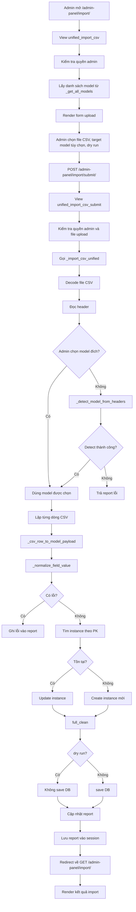

# Tài Liệu Chi Tiết Luồng Import CSV Tự Động Vào CSDL

## 1. Mục tiêu chức năng

Trang `http://127.0.0.1:8000/admin-panel/import/` là màn hình import CSV dành cho admin, cho phép:

- Upload 1 file `.csv`
- Tự động nhận diện model/bảng đích từ header CSV
- Hoặc cho admin chọn thủ công model đích
- Validate và chuẩn hóa dữ liệu theo field của model Django
- Tạo mới hoặc cập nhật bản ghi trong CSDL
- Trả về báo cáo import gồm số dòng thành công, cập nhật, tạo mới, cảnh báo và lỗi

Chức năng này được triển khai chủ yếu trong:

- [smart_chef/urls.py](/c:/vscode/smart-home-chef(ai%20agent)/smart_chef/urls.py)
- [apps/admin_panel/views.py](/c:/vscode/smart-home-chef(ai%20agent)/apps/admin_panel/views.py)
- [apps/admin_panel/data_manager_service.py](/c:/vscode/smart-home-chef(ai%20agent)/apps/admin_panel/data_manager_service.py)
- [smart_chef/templates/admin_panel/unified_import.html](/c:/vscode/smart-home-chef(ai%20agent)/smart_chef/templates/admin_panel/unified_import.html)
- [smart_chef/templates/admin_panel/js/unified_import.js](/c:/vscode/smart-home-chef(ai%20agent)/smart_chef/templates/admin_panel/js/unified_import.js)

## 2. Kiến trúc tổng thể

### 2.1 Các lớp tham gia

1. `URL Router`
   Nhận request tới `/admin-panel/import/` và `/admin-panel/import/submit/`.

2. `View layer`
   Gồm 2 view:
   - `unified_import_csv()`: render giao diện import
   - `unified_import_csv_submit()`: nhận file CSV và gọi service import

3. `Service layer`
   Toàn bộ logic nghiệp vụ import nằm trong `data_manager_service.py`, nổi bật là:
   - `_get_all_models()`
   - `_detect_model_from_headers()`
   - `_csv_row_to_model_payload()`
   - `_normalize_field_value()`
   - `_resolve_fk_instance()`
   - `_import_csv_unified()`

4. `Template/UI layer`
   Form upload file, chọn model đích, bật `dry run`, hiển thị báo cáo.

5. `Database layer`
   Ghi dữ liệu qua Django ORM bằng `model(**payload).save()` hoặc update instance đã tồn tại.

### 2.2 Mô hình trách nhiệm

- `views.py` chỉ điều phối request/response.
- `data_manager_service.py` chứa logic nhận diện bảng, parse CSV, validate và save DB.
- `template` chỉ hiển thị form và report.
- `session` được dùng để lưu report tạm sau khi submit rồi redirect về trang GET.

## 3. Route và entrypoint

Trong [smart_chef/urls.py](/c:/vscode/smart-home-chef(ai%20agent)/smart_chef/urls.py):

- `GET /admin-panel/import/`
  gọi `admin_views.unified_import_csv`

- `POST /admin-panel/import/submit/`
  gọi `admin_views.unified_import_csv_submit`

## 4. Danh sách model được hỗ trợ bởi unified import

Khác với màn `data-manager/model/<model_key>/` có thể import theo model cụ thể rộng hơn, trang `/admin-panel/import/` chỉ auto-import cho các model được khai báo trong `_get_all_models()`.

Danh sách hiện tại:

- `Account`
- `UserProfile`
- `Food`
- `Ingredient`
- `FoodIngredient`
- `Intent`
- `Pattern`
- `MealPlan`
- `NutritionLog`
- `DailyNutritionSummary`
- `UserGoal`
- `UserFeedback`
- `ChatSession`
- `ChatMessage`
- `ChatSummary`
- `MessageIntent`
- `AIRecommendation`

### 4.1 Nhóm nghiệp vụ của các model chính

- Người dùng:
  - `Account`
  - `UserProfile`
  - `UserGoal`
  - `UserFeedback`

- Dinh dưỡng/thực phẩm:
  - `Food`
  - `Ingredient`
  - `FoodIngredient`
  - `MealPlan`
  - `NutritionLog`
  - `DailyNutritionSummary`

- Chat/AI:
  - `Intent`
  - `Pattern`
  - `ChatSession`
  - `ChatMessage`
  - `ChatSummary`
  - `MessageIntent`
  - `AIRecommendation`

## 5. Luồng hoạt động tổng quát



## 6. Luồng xử lý chi tiết theo request

### 6.1 Bước 1: Admin mở trang import

Hàm `unified_import_csv(request)` thực hiện:

1. Kiểm tra quyền admin bằng `is_admin_actor(request)`
2. Nếu chưa đăng nhập admin thì redirect về trang login admin
3. Đọc `report` từ session key `unified_csv_report` nếu có
4. Lấy danh sách model từ `_get_all_models()`
5. Render template `admin_panel/unified_import.html`

Kết quả:

- Form upload hiển thị danh sách model có thể import
- Nếu lần submit trước vừa xong thì report sẽ được render ở phía dưới form

### 6.2 Bước 2: Admin submit file CSV

Hàm `unified_import_csv_submit(request)` thực hiện:

1. Kiểm tra quyền admin
2. Kiểm tra `csv_file` có trong `request.FILES` hay không
3. Lấy:
   - `uploaded_file`
   - `dry_run`
   - `target_model_key`
4. Gọi `_import_csv_unified(uploaded_file, dry_run, target_model_key)`
5. Lưu report vào session: `request.session['unified_csv_report'] = report`
6. Redirect về `unified_import_csv`

Lý do dùng redirect:

- Tránh submit lại form khi refresh trang
- Tách rõ POST xử lý và GET hiển thị kết quả

## 7. Cơ chế nhận diện model đích

### 7.1 Trường hợp admin chọn model thủ công

Nếu `target_model_key` được gửi lên:

- Service kiểm tra key này có tồn tại trong `_get_all_models()` không
- Nếu không hợp lệ, report trả lỗi ngay
- Nếu hợp lệ, bỏ qua bước auto-detect và dùng trực tiếp model đó

### 7.2 Trường hợp auto-detect theo header CSV

Nếu admin không chọn model đích, `_detect_model_from_headers(headers)` sẽ chạy.

### 7.3 Cách thuật toán detect hoạt động

1. Chuẩn hóa toàn bộ header:
   - trim khoảng trắng
   - lowercase
   - bỏ header rỗng
   - loại trùng theo thứ tự xuất hiện

2. Nếu toàn bộ header chỉ là các cột quá chung chung:
   - `id`
   - `name`
   - `title`
   - `created_at`
   - `updated_at`

   thì kết luận là `ambiguous`, không tự xác định model.

3. Với mỗi model trong `_get_all_models()`:
   - Lấy tập tên cột hợp lệ bằng `_get_import_column_names(model)`
   - Bao gồm cả:
     - `field.name`
     - `field.attname`

   Ví dụ:
   - FK `account` có thể map bởi `account` hoặc `account_id`
   - FK `food` có thể map bởi `food` hoặc `food_id`

4. Tính số header khớp với model:
   - `matched_headers`
   - `matched_count`

5. Tính điểm:

```text
score = header_coverage + (model_coverage * 0.15)
```

Trong đó:

- `header_coverage = matched_count / số header thực tế`
- `model_coverage = matched_count / số cột hợp lệ của model`

6. Sắp xếp candidate theo:
   - điểm cao hơn
   - số cột match nhiều hơn
   - số matched header
   - tên model

7. Điều kiện fail detect:
   - không có candidate nào
   - candidate tốt nhất chỉ match dưới 2 cột
   - model đứng nhất và nhì quá sát nhau:
     - `score_gap < 0.02`
     - và `matched_count` bằng nhau

8. Nếu detect fail:
   - report lỗi
   - kèm gợi ý top candidate để admin chọn thủ công

## 8. Luồng parse và chuẩn hóa từng dòng CSV

Sau khi xác định được model đích, `_import_csv_unified()` lặp qua từng dòng bằng `csv.DictReader`.

Mỗi dòng được xử lý qua:

```text
raw_row -> _csv_row_to_model_payload() -> payload + warnings + errors
```

### 8.1 Hàm `_csv_row_to_model_payload(model, raw_row)`

Hàm này duyệt qua toàn bộ `model._meta.fields` và:

1. Bỏ qua field auto-created không cần import
2. Tìm giá trị từ CSV theo:
   - `field.name`
   - hoặc `field.attname` nếu khác
3. Nếu field không xuất hiện trong CSV thì bỏ qua
4. Nếu có giá trị thì gọi `_normalize_field_value(field, row_value)`
5. Gom kết quả vào:
   - `payload`
   - `warnings`
   - `errors`

### 8.2 Mapping header CSV sang field model

Ví dụ:

- `username` -> `Account.username`
- `email` -> `Account.email`
- `account` hoặc `account_id` -> FK `account`
- `food` hoặc `food_id` -> FK `food`
- `ingredient` hoặc `ingredient_id` -> FK `ingredient`

## 9. Quy tắc chuẩn hóa dữ liệu theo kiểu field

Hàm `_normalize_field_value(field, raw_value)` là lõi chuẩn hóa dữ liệu.

### 9.1 Giá trị rỗng

Nếu giá trị sau khi trim là rỗng:

- Nếu field cho phép `null` hoặc `blank`, trả `None`
- Nếu là PK auto-created, bỏ qua
- Nếu field bắt buộc, báo lỗi `truong bat buoc`

### 9.2 ForeignKey

Nếu field là `many_to_one`:

1. Nếu rỗng:
   - trả `None` nếu FK cho phép null
   - nếu không thì lỗi `truong lien ket bat buoc`

2. Nếu có dữ liệu:
   gọi `_resolve_fk_instance(related_model, text)`

### 9.3 Các kiểu scalar được hỗ trợ

- `CharField`, `TextField`, `SlugField`, `UUIDField`
  - giữ text đã trim

- `EmailField`
  - lowercase toàn bộ

- `IntegerField`, `BigIntegerField`, `SmallIntegerField`, `PositiveIntegerField`, `PositiveSmallIntegerField`
  - parse bằng `_parse_int_value`

- `FloatField`
  - parse bằng `_parse_float_value`

- `DecimalField`
  - parse bằng `_parse_decimal_value`

- `BooleanField`, `NullBooleanField`
  - parse bằng `_parse_bool_value`

- `DateField`
  - parse bằng `_parse_date_value`

- `DateTimeField`
  - parse bằng `_parse_datetime_value`

- `JSONField`
  - parse bằng `_parse_json_value`

### 9.4 Các format được chấp nhận

#### Boolean

Giá trị `true`:

- `1`
- `true`
- `yes`
- `y`
- `on`
- `co`

Giá trị `false`:

- `0`
- `false`
- `no`
- `n`
- `off`
- `khong`

#### Date

Chấp nhận:

- `YYYY-MM-DD`
- `DD/MM/YYYY`
- `MM/DD/YYYY`
- `DD-MM-YYYY`

#### DateTime

Chấp nhận:

- ISO format, kể cả `Z`
- `YYYY-MM-DD HH:MM:SS`
- `DD/MM/YYYY HH:MM:SS`
- `YYYY-MM-DD HH:MM`

#### JSON

- Nếu parse JSON hợp lệ: trả object/list JSON
- Nếu không phải JSON nhưng có dấu phẩy: tách thành list chuỗi
- Nếu không: giữ nguyên text

## 10. Cơ chế resolve ForeignKey

Hàm `_resolve_fk_instance(related_model, raw_value)` xử lý lookup bản ghi liên kết.

### 10.1 Thứ tự resolve

1. Nếu giá trị là số:
   - tìm theo `pk`

2. Nếu không tìm được theo PK hoặc giá trị không phải số:
   - thử lần lượt các field sau nếu model có:
     - `username`
     - `email`
     - `name`
     - `title`

3. Dùng lookup `__iexact`

### 10.2 Ý nghĩa

Admin có thể import FK bằng:

- ID thật trong DB
- hoặc tên định danh tự nhiên như `username`, `email`, `name`, `title`

Ví dụ:

- `account_id=5`
- `account=admin`
- `food=Chicken Salad`
- `intent=nutrition`

### 10.3 Khi nào lỗi

Nếu không resolve được bản ghi FK:

- dòng đó bị đánh dấu lỗi
- message: `khong tim thay ban ghi lien ket`

## 11. Cơ chế create/update dữ liệu

Sau khi có `payload` hợp lệ, service quyết định `create` hay `update`.

### 11.1 Cách xác định bản ghi hiện có

Service đọc:

- `pk_name = model._meta.pk.name`
- sau đó lấy `pk_raw = raw_row.get(pk_name) or raw_row.get('id')`

Nếu CSV có PK:

- tìm instance: `model.objects.filter(pk=pk_text).first()`

### 11.2 Luồng update

Nếu tìm thấy instance:

1. Gán từng field trong `payload` vào object hiện có
2. Gọi `instance.full_clean()`
3. Nếu không phải `dry_run` thì `instance.save()`
4. Tăng `updated_rows`

### 11.3 Luồng create

Nếu không tìm thấy instance:

1. Tạo object mới bằng `model(**payload)`
2. Gọi `instance.full_clean()`
3. Nếu không phải `dry_run` thì `instance.save()`
4. Tăng `created_rows`

### 11.4 Ý nghĩa thực tế

Chức năng này đang hoạt động theo mô hình:

- `upsert by primary key`

Nó không update theo unique field khác như:

- `username`
- `email`
- `name`

trừ khi các giá trị đó là FK để resolve liên kết. Nghĩa là:

- Có PK trong CSV và PK tồn tại trong DB -> update
- Không có PK hoặc PK không tồn tại -> create

## 12. Cơ chế validate trước khi ghi DB

Mỗi instance đều được gọi:

```python
instance.full_clean()
```

Do đó hệ thống tận dụng validation của Django model:

- required field
- field type
- validators
- unique constraints
- model-level validation nếu có

Nếu `full_clean()` ném `ValidationError`:

- dòng đó không được save
- report ghi lỗi bằng `exc.messages`

## 13. Dry Run

Nếu admin bật checkbox `dry_run`:

- toàn bộ parse, detect, normalize, resolve FK và `full_clean()` vẫn chạy bình thường
- nhưng không gọi `save()`

Ý nghĩa:

- kiểm tra dữ liệu trước khi import thật
- phát hiện lỗi format, lỗi FK, lỗi validation
- an toàn cho dataset lớn hoặc dataset chưa chắc chắn

## 14. Cấu trúc report trả về

`_import_csv_unified()` trả report dạng dictionary:

```python
{
    'detected_model': ...,
    'total_rows': 0,
    'ok_rows': 0,
    'created_rows': 0,
    'updated_rows': 0,
    'error_rows': 0,
    'warning_rows': 0,
    'dry_run': True/False,
    'details': [],
}
```

### 14.1 Ý nghĩa từng field

- `detected_model`
  model đã chọn hoặc detect được

- `total_rows`
  tổng số dòng dữ liệu, không tính header

- `ok_rows`
  số dòng hợp lệ và vượt qua `full_clean()`

- `created_rows`
  số bản ghi mới

- `updated_rows`
  số bản ghi cập nhật

- `error_rows`
  số dòng lỗi

- `warning_rows`
  số dòng cảnh báo

- `details`
  danh sách chi tiết lỗi/cảnh báo theo từng dòng

### 14.2 Giới hạn details

Cuối hàm:

```python
report['details'] = report['details'][:120]
```

Nghĩa là UI chỉ giữ tối đa 120 chi tiết đầu tiên để tránh report quá lớn.

## 15. Hiển thị kết quả ở giao diện

Template `unified_import.html` sẽ:

1. Hiển thị model đích trong report
2. Hiển thị cảnh báo nếu là `dry_run`
3. Hiển thị thống kê:
   - tổng dòng
   - thành công
   - cập nhật
   - tạo mới
4. Hiển thị tổng số warning/error
5. Render bảng chi tiết từng dòng lỗi/cảnh báo

Luồng session:

1. POST submit xong -> lưu report vào session
2. redirect về GET
3. GET đọc và `pop()` report khỏi session
4. report chỉ hiển thị 1 lần sau submit

## 16. JavaScript hỗ trợ ở client

File `smart_chef/templates/admin_panel/js/unified_import.js` chỉ làm 2 việc:

1. Nút `Xóa`
   - reset giá trị input file

2. Khi submit form
   - disable nút submit
   - đổi text nút thành trạng thái đang upload

Kết luận:

- Toàn bộ nghiệp vụ import nằm ở backend
- frontend không parse CSV, không validate dữ liệu nghiệp vụ

## 17. Mô hình dữ liệu liên quan trong import

### 17.1 Một số model tiêu biểu và kiểu quan hệ

- `UserProfile.account` -> `OneToOneField(Account)`
- `UserGoal.account` -> `ForeignKey(Account)`
- `UserFeedback.account` -> `ForeignKey(Account)`
- `UserFeedback.food` -> `ForeignKey(Food)`
- `Food.category` -> `ForeignKey(FoodCategory)`
- `FoodIngredient.food` -> `ForeignKey(Food)`
- `FoodIngredient.ingredient` -> `ForeignKey(Ingredient)`
- `MealPlan.account` -> `ForeignKey(Account)`
- `MealPlan.food` -> `ForeignKey(Food)`
- `NutritionLog.account` -> `ForeignKey(Account)`
- `NutritionLog.food` -> `ForeignKey(Food)`
- `Pattern.intent` -> `ForeignKey(Intent)`
- `ChatMessage.session` -> `ForeignKey(ChatSession)`
- `ChatSummary.session` -> `ForeignKey(ChatSession)`
- `MessageIntent.message` -> `ForeignKey(ChatMessage)`
- `MessageIntent.intent` -> `ForeignKey(Intent)`
- `AIRecommendation.account` -> `ForeignKey(Account)`
- `AIRecommendation.food` -> `ForeignKey(Food)`

### 17.2 Ý nghĩa với import CSV

Vì có nhiều FK, một file CSV import thành công thường phụ thuộc vào:

- bản ghi cha đã tồn tại sẵn trong DB
- hoặc CSV sử dụng đúng khóa tự nhiên mà hàm FK resolver hỗ trợ

Ví dụ:

- import `FoodIngredient` cần `Food` và `Ingredient` tồn tại trước
- import `MessageIntent` cần `ChatMessage` và `Intent` tồn tại trước
- import `AIRecommendation` cần `Account` và `Food` tồn tại trước

## 18. Các tình huống lỗi chính

### 18.1 Lỗi ở mức file/header

- Không upload file
- CSV không có header
- Không xác định được model đích
- `target_model_key` không hợp lệ

### 18.2 Lỗi ở mức dòng dữ liệu

- field bắt buộc bị rỗng
- parse số/date/datetime/boolean thất bại
- FK không tìm thấy bản ghi liên kết
- vi phạm unique constraint
- dữ liệu không qua `full_clean()`
- exception không lường trước khi save

## 19. Giới hạn và đặc điểm hiện tại của implementation

### 19.1 Chỉ import theo field xuất hiện đúng tên

Hệ thống chưa có lớp mapping alias header kiểu:

- `user_name` -> `username`
- `meal` -> `meal_type`
- `qty` -> `quantity_grams`

Header phải trùng với:

- `field.name`
- hoặc `field.attname`

### 19.2 Upsert chỉ theo primary key

Không có logic:

- update theo `username`
- update theo `email`
- update theo cặp unique field

### 19.3 Không import chuỗi quan hệ nhiều cấp

Chức năng chỉ resolve 1 cấp FK trực tiếp, không tự tạo bản ghi liên quan nếu thiếu.

### 19.4 Không có transaction bao toàn file

Import hiện tại xử lý theo từng dòng. Điều này có nghĩa:

- một số dòng có thể save thành công
- một số dòng khác có thể fail

Đây là kiểu `partial success`, không phải `all-or-nothing`.

### 19.5 Danh sách model hỗ trợ bị giới hạn

Trang unified import không dùng toàn bộ `ADMIN_MODEL_LOOKUP`, mà chỉ dùng các model trong `_get_all_models()`.

### 19.6 Fallback decode hiện tại có rủi ro

Trong `_import_csv_unified()` và `_import_csv_to_model()`:

- code đọc `uploaded_file.read()` để decode `utf-8-sig`
- nếu lỗi `UnicodeDecodeError`, code lại gọi `uploaded_file.read()` lần nữa để decode `latin-1`

Vì con trỏ file có thể đã ở cuối stream sau lần đọc đầu, nhánh fallback này có nguy cơ nhận dữ liệu rỗng. Đây là điểm cần lưu ý nếu import file encoding không phải UTF-8.

## 20. Trình tự import khuyến nghị theo dữ liệu phụ thuộc

Để hạn chế lỗi FK, nên import theo thứ tự:

1. `Account`
2. `UserProfile`, `UserGoal`
3. `Food`, `Ingredient`, `Intent`
4. `FoodIngredient`, `Pattern`, `MealPlan`, `NutritionLog`, `ChatSession`
5. `UserFeedback`, `ChatMessage`, `ChatSummary`
6. `MessageIntent`, `AIRecommendation`

## 21. Ví dụ luồng import thực tế

### 21.1 Ví dụ import `FoodIngredient`

CSV:

```csv
food_id,ingredient_id,quantity_grams
10,3,120
10,5,15
```

Luồng:

1. Header khớp mạnh với model `FoodIngredient`
2. Dòng 2:
   - resolve `food_id=10` -> tìm `Food(pk=10)`
   - resolve `ingredient_id=3` -> tìm `Ingredient(pk=3)`
   - parse `quantity_grams=120` -> Decimal
3. Nếu bản ghi `(food, ingredient)` chưa có nhưng PK không truyền lên:
   - hệ thống vẫn tạo bản ghi mới
4. Nếu vi phạm unique constraint `('food', 'ingredient')`
   - `full_clean()` hoặc save sẽ báo lỗi

### 21.2 Ví dụ import `Account`

CSV:

```csv
id,username,email,password_hash,role,is_active
1,admin,admin@example.com,hash_here,admin,true
```

Luồng:

1. Có `id=1`
2. Nếu `Account(pk=1)` đã tồn tại -> update
3. Nếu chưa tồn tại -> create
4. `email` được lowercase
5. `is_active=true` được parse thành boolean `True`

## 22. Kết luận

Chức năng `/admin-panel/import/` đang được thiết kế theo mô hình:

- giao diện mỏng
- service backend tập trung
- auto-detect model theo header CSV
- normalize dữ liệu theo kiểu field Django
- resolve FK trực tiếp
- validate bằng `full_clean()`
- upsert theo primary key
- report kết quả qua session

Đây là một cơ chế import tương đối linh hoạt cho admin, phù hợp với dữ liệu CSV có cấu trúc rõ ràng và đã chuẩn hóa header theo model Django. Điểm mạnh là tận dụng metadata của model để giảm hard-code; điểm cần lưu ý là phụ thuộc mạnh vào tên cột chính xác, thứ tự import dữ liệu có quan hệ, và hiện chưa có transaction toàn file hay mapping header nâng cao.
