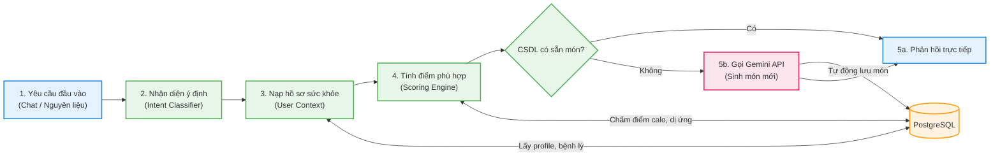

# Kiến trúc Hệ thống Cá nhân hóa - Smart Home Chef (Tối giản)

Sơ đồ thể hiện luồng xử lý yêu cầu người dùng theo dạng pipeline (đường ống) tuần tự, từ khi nhận thông tin đầu vào đến khi trả về kết quả cá nhân hóa trên giao diện.

---

## 1. Sơ đồ luồng xử lý tối giản (Flowchart)

---

## 2. Giải thích 5 bước cốt lõi

1.  **Yêu cầu đầu vào:** Người dùng nhập nguyên liệu hiện có hoặc đặt câu hỏi yêu cầu thực đơn.
2.  **Nhận diện ý định:** Hệ thống phân tích xem người dùng muốn nấu ăn (Recipe) hay lập thực đơn (Meal Plan).
3.  **Nạp hồ sơ sức khỏe:** Lấy dữ liệu cá nhân trong PostgreSQL (bệnh nền, ngân sách, nhóm nguyên liệu dị ứng).
4.  **Tính điểm phù hợp (Scoring):** Chấm điểm các món ăn từ `0.0` đến `1.0` (Ưu tiên món hợp calo/bệnh lý, loại bỏ món dị ứng).
5.  **Trả kết quả:** 
    *   Nếu CSDL có sẵn món phù hợp $\rightarrow$ Trả kết quả ngay.
    *   Nếu thiếu món $\rightarrow$ Gọi **Gemini API** sinh món mới, lưu vào CSDL rồi gửi cho người dùng.
