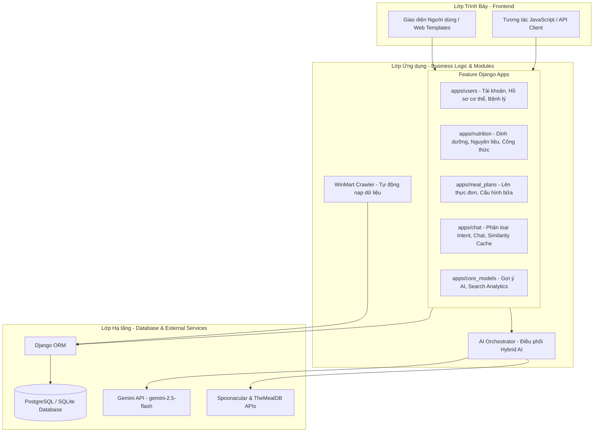
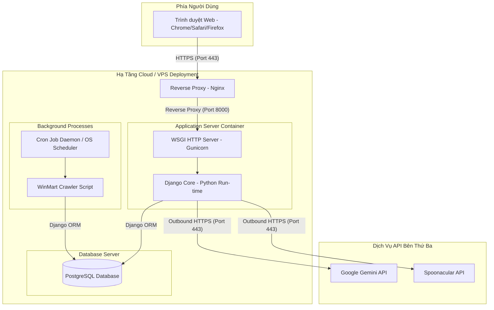

# slide 1: slide tiêu đề
## SMART HOME CHEF
### Hệ Thống Trợ Lý AI Hỗ Trợ Dinh Dưỡng, Công Thức Và Lên Kế Hoạch Bữa Ăn Cá Nhân Hóa

- **Nhóm thực hiện**: [Tên các thành viên]
- **Sản phẩm chính**: Nền tảng lập thực đơn, quản lý dinh dưỡng thông minh tích hợp Hybrid AI.

---

> [!NOTE]
> **Lời thoại thuyết trình gợi ý:**
> "Kính thưa các thầy cô, hôm nay nhóm em xin trình bày về đề tài 'Smart Home Chef' - một hệ thống trợ lý AI hỗ trợ dinh dưỡng, đề xuất công thức và lên kế hoạch bữa ăn cá nhân hóa dựa trên dữ liệu thực tế và trí tuệ nhân tạo."

---

# slide 2: vấn đề cần giải quyết (as-is & thách thức)
## VẤN ĐỀ CẦN GIẢI QUYẾT & BỐI CẢNH

- **Hiện trạng dữ liệu thực phẩm**: Rời rạc, thiếu đồng bộ, nhập thủ công, dễ trùng lặp.
- **Thiếu chuẩn hóa**: Tên gọi, danh mục và đơn vị đo dinh dưỡng không thống nhất giữa các nguồn.
- **Tính an toàn & Cá nhân hóa kém**: 
  - Khó kiểm soát đối với người dùng có bệnh lý (tiểu đường, cao huyết áp,...).
  - Chưa tối ưu hóa thực đơn theo ngân sách và calo đích của từng cá nhân.
- **Thách thức hệ thống**: Rò rỉ dữ liệu người dùng (lịch sử ăn uống, lịch sử chat) và chi phí gọi API LLM lớn.

---

> [!NOTE]
> **Lời thoại thuyết trình gợi ý:**
> "Trong thực tế, việc quản lý thực đơn dinh dưỡng gặp nhiều thách thức. Thứ nhất là dữ liệu thực phẩm từ các nguồn thu thập về thường không nhất quán về tên gọi và đơn vị. Thứ hai là hệ thống cũ chưa cá nhân hóa sâu theo bệnh lý hay ngân sách. Thứ ba là các vấn đề kỹ thuật như rò rỉ dữ liệu giữa các tài khoản và chi phí duy trì API AI quá cao nếu gọi liên tục."

---

# slide 3: mục tiêu & phạm vi dự án (to-be)
## MỤC TIÊU & PHẠM VI DỰ ÁN

- **Mục tiêu**: Tự động hóa quy trình nạp (crawl), chuẩn hóa dữ liệu thực phẩm, và áp dụng mô hình Hybrid AI để lập thực đơn an toàn, cá nhân hóa sâu.
- **Phạm vi chức năng**:
  - **Quản lý dữ liệu (Data Governance)**: Crawler tự động, pipeline chuẩn hóa danh mục, hàng đợi duyệt thực phẩm (Verification Queue).
  - **Cá nhân hóa (Personalization)**: Lên thực đơn theo calo tiêu chuẩn, giới hạn chi phí, lọc bỏ các món kỵ với bệnh lý nền.
  - **Bảo mật & Tối ưu**: Phân quyền chặt chẽ, audit log, cô lập dữ liệu theo tài khoản và tối ưu hóa bộ đệm AI.

---

> [!NOTE]
> **Lời thoại thuyết trình gợi ý:**
> "Để giải quyết các vấn đề trên, dự án hướng tới mục tiêu xây dựng quy trình tự động hóa nạp và chuẩn hóa dữ liệu thực phẩm. Đồng thời, phạm vi của hệ thống sẽ tập trung vào việc cá nhân hóa thực đơn theo chỉ số cơ thể, hạn mức chi tiêu, hỗ trợ an toàn cho người bệnh lý, đồng thời bảo mật tuyệt đối dữ liệu người dùng và tối ưu chi phí vận hành AI."

---

# slide 4: công nghệ sử dụng - core & database
## CÁC CÔNG NGHỆ ĐÃ SỬ DỤNG (1)

- **Python & Django Framework**:
  - Cung cấp cấu trúc Clean Architecture theo tính năng, hệ thống ORM bảo mật, và admin panel mạnh mẽ phục vụ quản trị dữ liệu.
- **PostgreSQL Database**:
  - Đảm bảo tính toàn vẹn dữ liệu (ràng buộc khóa ngoại, unique index) và lưu trữ lịch sử giá, lịch sử người dùng an toàn.
- **BeautifulSoup4 & Requests (Crawler)**:
  - Thu thập tự động dữ liệu sản phẩm từ API và cấu trúc HTML của WinMart theo lịch trình định sẵn.

---

> [!NOTE]
> **Lời thoại thuyết trình gợi ý:**
> "Về mặt công nghệ, nhóm sử dụng ngôn ngữ Python kết hợp Django làm framework backend chính để phát triển theo kiến trúc Clean Architecture giúp hệ thống dễ bảo trì. Cơ sở dữ liệu sử dụng PostgreSQL để đảm bảo toàn vẹn dữ liệu và lưu lịch sử giá. Các thư viện BeautifulSoup4 và Requests được dùng để crawler dữ liệu tự động từ hệ thống siêu thị WinMart."

---

# slide 5: công nghệ sử dụng - ai & performance
## CÁC CÔNG NGHỆ ĐÃ SỬ DỤNG (2)

- **Google Gemini API (gemini-2.5-flash)**:
  - Mô hình ngôn ngữ lớn đóng vai trò NLU phân tích ý định chat, trích xuất nguyên liệu từ ngôn ngữ tự nhiên, dịch thuật và sinh thực đơn dự phòng (fallback).
- **Spoonacular & TheMealDB API**:
  - Tích hợp để đối chiếu công thức nấu ăn quốc tế và làm giàu dinh dưỡng vi lượng (vitamins, khoáng chất).
- **Similarity Cache (Jaccard Similarity)**:
  - Thuật toán so khớp độ tương đồng văn bản tự động lưu và tái sử dụng câu trả lời của AI, tiết kiệm 70% số lượt gọi API.

---

> [!NOTE]
> **Lời thoại thuyết trình gợi ý:**
> "Ở lớp trí tuệ nhân tạo, nhóm tích hợp Google Gemini API phiên bản 2.5 Flash để phân tích ngôn ngữ tự nhiên, trích xuất nguyên liệu từ câu chat và tạo thực đơn dự phòng khi database thiếu món. Ngoài ra, Spoonacular và TheMealDB được dùng để làm giàu vi chất dinh dưỡng. Để tối ưu chi phí và tăng tốc phản hồi chat, nhóm xây dựng Similarity Cache dựa trên độ tương đồng Jaccard giúp tái sử dụng câu trả lời AI."

---

# slide 6: mô hình kiến trúc tổng thể
## MÔ HÌNH KIẾN TRÚC TỔNG THỂ (HYBRID ARCHITECTURE)

---

> [!NOTE]
> **Lời thoại thuyết trình gợi ý (Cần học thuộc để giải thích từng phần):**
> "Kiến trúc hệ thống được thiết kế theo mô hình 3 lớp chuẩn doanh nghiệp:
> 1. **Lớp Trình Bày (Frontend)**: Xử lý giao diện tương tác của người dùng.
> 2. **Lớp Ứng Dụng (Application)**: Gồm 5 Django app độc lập tương ứng với các phân hệ nghiệp vụ (`users`, `nutrition`, `meal_plans`, `chat`, `core_models`). Bộ điều phối `AI Orchestrator` quyết định khi nào cần gọi DB nội bộ và khi nào cần gọi LLM bên ngoài. Bộ `Crawler` thu thập dữ liệu WinMart chạy ngầm độc lập.
> 3. **Lớp Hạ Tầng (Infrastructure)**: Sử dụng Django ORM để giao tiếp an toàn với cơ sở dữ liệu PostgreSQL, và kết nối bảo mật ra các API dịch vụ ngoài như Gemini và Spoonacular."

---

# slide 7: sơ đồ triển khai hệ thống
## SƠ ĐỒ TRIỂN KHAI HỆ THỐNG (DEPLOYMENT SCHEMA)

---

> [!NOTE]
> **Lời thoại thuyết trình gợi ý:**
> "Về mô hình triển khai:
> - Người dùng truy cập qua **Trình duyệt** bằng kết nối HTTPS an toàn thông qua cổng Reverse Proxy **Nginx** để đảm bảo bảo mật và cân bằng tải.
> - Request được chuyển tiếp cho ứng dụng **Django** chạy trên **Gunicorn** server.
> - Hệ thống crawler chạy độc lập qua **Cron Job Daemon** nạp dữ liệu trực tiếp vào database mà không ảnh hưởng hiệu năng của web app.
> - **PostgreSQL Database** được cô lập trong mạng nội bộ của server. Các API ngoài như **Gemini** và **Spoonacular** được kết nối qua kênh outbound HTTPS."

---

# slide 8: kết luận - nội dung đã đạt được
## KẾT LUẬN: CÁC NỘI DUNG ĐÃ ĐẠT ĐƯỢC

- **Bảo mật & Cô lập dữ liệu cá nhân (User Isolation)**: Lịch sử thực đơn và lịch sử chat được phân quyền và lọc chính xác theo `account_id`, giải quyết triệt để lỗi rò rỉ dữ liệu.
- **Tích hợp Giá & Crawler tự động**: Thu thập dữ liệu giá từ WinMart, tự động ánh xạ vào bảng giá (`food_prices`, `ingredient_prices`) để tính toán chi phí thực đơn.
- **Quy trình Kiểm duyệt Dữ liệu (Data Governance)**: Xây dựng hàng đợi duyệt thực phẩm thô (`food_verification_queue`) và log thay đổi dữ liệu (`audit_logs`) dành cho Data Steward.
- **Dinh dưỡng hỗ trợ bệnh lý nền**: Triển khai liên kết bệnh lý (`diseases`) và quy tắc lọc dinh dưỡng an toàn (`disease_nutrition_rules`).
- **Chiến lược Hybrid AI tối ưu**: Nguyên lý **DB-First, LLM-Fallback** kết hợp **Similarity Cache** giảm tải 70% chi phí gọi API Gemini.

---

> [!NOTE]
> **Lời thoại thuyết trình gợi ý:**
> "Sau quá trình thực hiện, hệ thống đã đạt được các cột mốc quan trọng theo yêu cầu bổ sung của thầy cô:
> 1. Giải quyết triệt để vấn đề bảo mật dữ liệu riêng tư của người dùng: Lịch sử chat và thực đơn được cô lập hoàn toàn giữa các tài khoản.
> 2. Đã tích hợp thành công dữ liệu giá thực tế từ WinMart để ước tính chi phí bữa ăn.
> 3. Triển khai quy trình kiểm duyệt dữ liệu chuyên nghiệp thông qua hàng đợi phê duyệt món ăn cho Admin và ghi Audit Logs chi tiết.
> 4. Hỗ trợ người dùng có bệnh lý nền thông qua bộ quy tắc dinh dưỡng tự động loại trừ các nguyên liệu nguy hiểm.
> 5. Tối ưu hóa chi phí AI nhờ mô hình Hybrid AI ưu tiên DB nội bộ và Similarity Cache."

---

# slide 9: kết luận - định hướng phát triển
## ĐỊNH HƯỚNG PHÁT TRIỂN / NÂNG CẤP

- **Nâng cấp Semantic Intent Matching**: Sử dụng bảng `intent_embeddings` đã thiết kế để so khớp ý nghĩa tin nhắn chat thay vì dùng từ khóa cứng.
- **Thuật toán Tự học và Xếp hạng cá nhân hóa**: Áp dụng Feedback Loop từ đánh giá người dùng (`UserFeedback`) để tự động điều chỉnh trọng số gợi ý món ăn.
- **Tích hợp Incompatibility Matrix nâng cao**: Cảnh báo tự động các nguyên liệu kị nhau khi kết hợp dựa trên chỉ dẫn y tế.
- **Mở rộng Crawlers đa kênh**: Tích hợp thêm dữ liệu giá từ Bách Hóa Xanh và CoopMart để tối ưu hóa gợi ý địa điểm mua sắm có giá tốt nhất cho người dùng.

---

> [!NOTE]
> **Lời thoại thuyết trình gợi ý:**
> "Để hoàn thiện hệ thống hơn nữa trong tương lai, nhóm định hướng các nâng cấp trọng tâm sau:
> 1. Triển khai so khớp ý định chat bằng vector ngữ nghĩa (semantic embedding) thay cho từ khóa heuristic.
> 2. Áp dụng cơ chế Feedback Loop để hệ thống tự động học sở thích của người dùng qua thời gian và xếp hạng món tốt hơn.
> 3. Bổ sung ma trận tương kỵ thực phẩm để tránh các kết hợp nguyên liệu nguy hại.
> 4. Mở rộng crawler sang các hệ thống siêu thị khác như Bách Hóa Xanh để tối ưu bài toán so sánh chi phí đi chợ."
