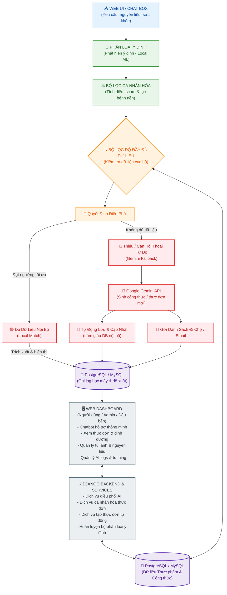

# KIẾN TRÚC TỔNG THỂ HỆ THỐNG SMART HOME CHEF

Tài liệu này trình bày mô hình kiến trúc tổng thể hệ thống của dự án **Smart Home Chef** được xây dựng và ánh xạ dựa trên mẫu kiến trúc hệ thống nhận diện khuôn mặt gốc (luồng xử lý từ phần cứng/đầu vào -> xử lý mô hình AI -> so khớp dữ liệu -> đưa ra quyết định & phân nhánh hành động -> đồng bộ hóa với Dashboard quản trị và cơ sở dữ liệu log).

---

## 1. Sơ Đồ Kiến Trúc Tổng Thể (Mermaid Diagram)

Sơ đồ dưới đây mô phỏng lại đúng cấu trúc hình ảnh mẫu của bạn bằng tiếng Việt: dòng chảy ngang từ đầu vào qua các lớp xử lý AI nội bộ, bộ lọc quyết định, cho đến các nhánh hành động và hệ thống quản trị Web Dashboard kết nối với Backend.

---

## 2. Bảng Ánh Xạ Thành Phần Tương Đương

Để làm rõ cách chuyển dịch từ **Hệ thống Nhận diện Khuôn mặt** (mẫu gốc) sang **Hệ thống Trợ lý Dinh dưỡng & Thực đơn (Smart Home Chef)**, dưới đây là bảng đối chiếu chi tiết:

| Thành phần mẫu gốc (Nhận diện khuôn mặt) | Thành phần tương đương trong Smart Home Chef | Vai trò & Giải thuật trong hệ thống hiện tại |
| :--- | :--- | :--- |
| **CAMERA (Đầu vào)** | **WEB UI / CHAT BOX** | Tiếp nhận các thông tin đầu vào từ người dùng (Văn bản yêu cầu, danh sách nguyên liệu còn lại trong tủ lạnh, thông tin sức khỏe cơ bản). |
| **RetinaFace (Phát hiện khuôn mặt)** | **Intent Classifier (Phát hiện ý định)** | Sử dụng bộ phân loại intent cục bộ (tải từ `intent_classifier.json` đã được train từ các `Pattern` và `Intent` trong Database) để phát hiện ý định người dùng muốn làm gì. |
| **ArcFace (Trích xuất Embedding 512D)** | **Personalization Engine (Trích xuất đặc trưng & Cá nhân hóa)** | Dịch vụ `personalization_service.py` trích xuất thông tin sức khỏe (chỉ số BMI, bệnh lý, dị ứng) và tính điểm tương thích cá nhân hóa $S(u, f)$ cho từng món ăn. |
| **Cosine Similarity (Ngưỡng 0.45)** | **Local Rule & Score Filter (Lọc độ tương thích & Lọc bệnh nền)** | Thực hiện kiểm tra ràng buộc (Hard constraints) để loại bỏ các món ăn cấm kỵ (ví dụ: gút thì bỏ thịt đỏ, tiểu đường thì bỏ đường ngọt) và so khớp các món ăn có điểm score cao. |
| **MySQL (Embedding đã đăng ký)** | **PostgreSQL/MySQL (Dữ liệu Thực phẩm & Công thức)** | Cơ sở dữ liệu chứa danh mục thực phẩm, món ăn nội bộ đã chuẩn hóa cùng thông tin dinh dưỡng vi lượng/đa lượng phục vụ cho việc chấm điểm. |
| **Kết quả nhận diện** | **Quyết định điều phối đề xuất (AI Orchestrator)** | Dịch vụ `ai_orchestrator_service.py` đóng vai trò điều phối chính: Đánh giá xem dữ liệu nội bộ có đủ đáp ứng nhu cầu hay không để chọn luồng xử lý. |
| **Đã đăng ký (Khớp mẫu $\ge$ 0.45)** | **Đầy đủ dữ liệu nội bộ (Local Match)** | Khi các món ăn chấm điểm cục bộ đáp ứng đầy đủ chỉ tiêu calo và số lượng bữa ăn trong ngày $\rightarrow$ Trả về trực tiếp thực đơn/món ăn từ DB nội bộ. |
| **Người lạ (Không khớp < 0.45)** | **Thiếu dữ liệu / Cần sinh tự do (Gemini Fallback)** | Khi dữ liệu cục bộ bị thiếu (ví dụ: thiếu nguyên liệu nấu ăn sáng) hoặc người dùng chat tự do $\rightarrow$ Chuyển tiếp yêu cầu (prompt) sang **Google Gemini API**. |
| **Cảnh báo (Alarm)** | **Tự động lưu & Cập nhật (Sync & Enrich)** | Khi Gemini API trả về công thức/món ăn mới, hệ thống tự động cập nhật, chuẩn hóa và lưu trữ ngược lại vào cơ sở dữ liệu cục bộ để làm giàu dữ liệu. |
| **Gửi Email** | **Gửi Shopping List / Email** | Kích hoạt chức năng tự động gửi email danh sách nguyên liệu cần mua (Shopping List) cho người dùng dựa trên thực đơn đã lập. |
| **MySQL (Ghi log)** | **PostgreSQL/MySQL (Ghi log học máy & Đề xuất)** | Ghi log toàn bộ lịch sử trò chuyện (`ChatMessage`), phân loại ý định (`MessageIntent`) và log đề xuất (`RecommendationLog`) để phục vụ quá trình huấn luyện lại AI nội bộ. |
| **FastAPI Backend (Xử lý API)** | **Django Backend (Core Services)** | Máy chủ ứng dụng Django chịu trách nhiệm xử lý logic nghiệp vụ, chạy các dịch vụ AI nội bộ, kết nối dữ liệu và trả kết quả dưới dạng API/HTML. |
| **Web Dashboard (Admin/Guard)** | **Web Dashboard (User / Admin / Chef)** | Giao diện tương tác: Người dùng cuối (xem thực đơn cá nhân hóa, chat dinh dưỡng), Quản trị viên (quản lý dinh dưỡng, giám sát log học máy, huấn luyện mô hình). |

---

## 3. Quy Trình Vận Hành Và Luồng Dữ Liệu (Data Flow)

Hệ thống Smart Home Chef vận hành thông qua sự phối hợp nhịp nhàng giữa **AI nội bộ (Internal AI)** và **AI bên ngoài (External Gemini Fallback)** để đảm bảo tốc độ tối ưu, độ an toàn sức khỏe và khả năng mở rộng dữ liệu:

1. **Tiếp nhận yêu cầu (Input):**
   * Người dùng đăng nhập vào hệ thống, cập nhật hồ sơ sức khỏe hoặc nhập yêu cầu trực tiếp vào Chat Box (ví dụ: *"Lên thực đơn giảm cân cho tôi với nguyên liệu có sẵn là trứng và cà chua"*).
2. **Phát hiện ý định & Phân tích NLU (Intent Classifier):**
   * Django Backend nhận thông tin, gửi qua `ai_orchestrator_service.py`.
   * Bộ Intent Classifier nội bộ phân tích văn bản để xác định xem người dùng muốn **Lập thực đơn (Meal Plan)**, **Gợi ý công thức (Recipe Suggestion)** hay chỉ **Hỏi đáp dinh dưỡng (Nutrition Chat)**.
3. **Tính điểm cá nhân hóa (Personalization & Constraints):**
   * `personalization_service.py` lấy thông tin sức khỏe (chỉ số BMI, bệnh lý) của người dùng để áp dụng bộ lọc loại trừ (ví dụ: loại trừ đường sữa nếu người dùng dị ứng lactose).
   * Tính toán điểm tương thích dinh dưỡng cho các món ăn phù hợp với Calo mục tiêu của người dùng.
4. **Lọc dữ liệu cục bộ & Quyết định (Orchestration Decision):**
   * Hệ thống tìm kiếm các món ăn có nguyên liệu là "trứng" và "cà chua" trong cơ sở dữ liệu PostgreSQL cục bộ.
   * **Nếu có đủ món ăn phù hợp:** Lập tức thiết lập thực đơn và trả về kết quả cho người dùng (Tiết kiệm chi phí API, tăng tốc độ xử lý).
   * **Nếu thiếu món ăn hoặc cần công thức biến thể đặc biệt:** Hệ thống chuyển tiếp yêu cầu sang **Google Gemini API** làm fallback.
5. **Đồng bộ hóa & Cập nhật (Fallback & Write-back):**
   * Google Gemini sinh công thức món ăn mới dựa trên prompt sức khỏe và nguyên liệu.
   * Django Backend nhận kết quả JSON từ Gemini, tự động phân tích thành phần dinh dưỡng và lưu vào bảng `FOODS` và `RECIPES` trong DB nội bộ để lần sau không cần gọi API ngoài nữa.
   * Đồng thời, hệ thống tạo ra `Shopping List` (danh sách đi chợ) gửi qua email người dùng.
6. **Lưu log & Học máy cục bộ (Logging & Retraining Loop):**
   * Toàn bộ lịch sử nhận diện ý định, điểm số đề xuất và tương tác của người dùng được ghi log vào `RecommendationLog`.
   * Quản trị viên hệ thống có thể theo dõi độ chính xác của AI nội bộ trên **Web Dashboard** và nhấn nút chạy `model_training_service.py` để tái huấn luyện mô hình từ dữ liệu log mới tích lũy.
