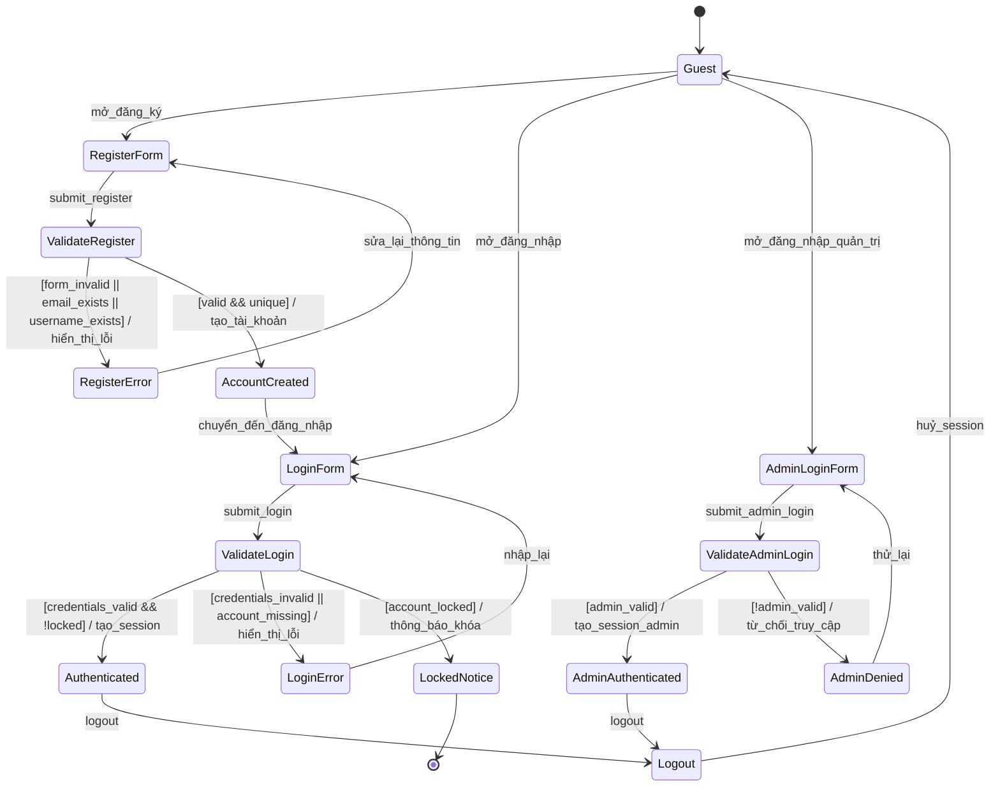
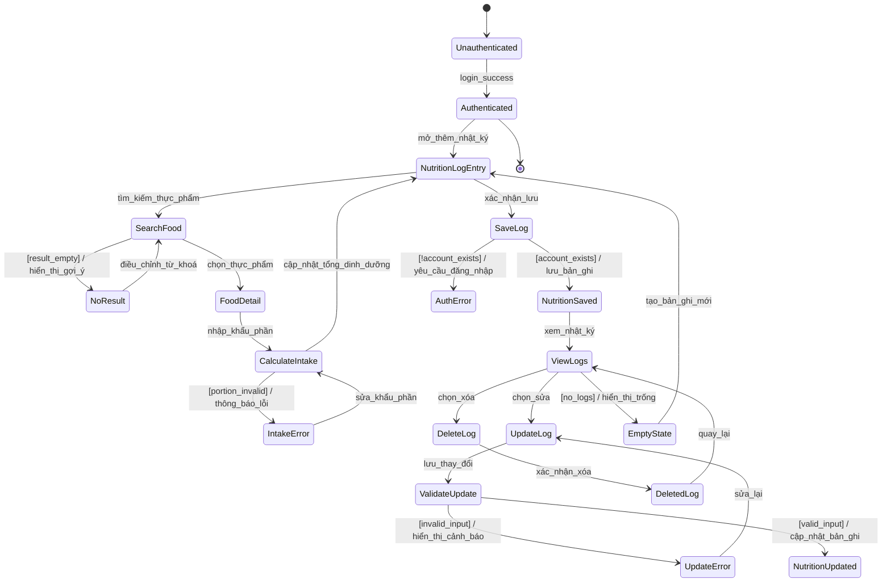
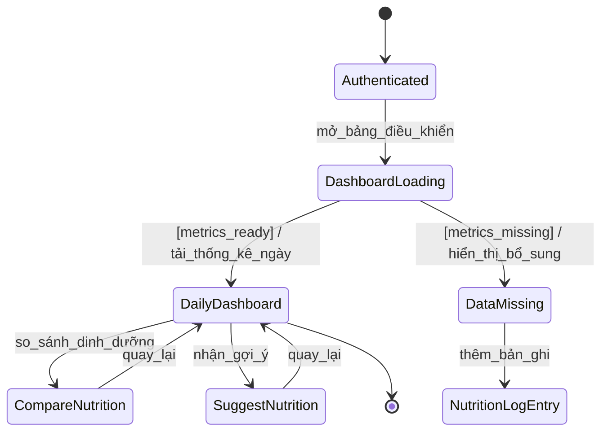
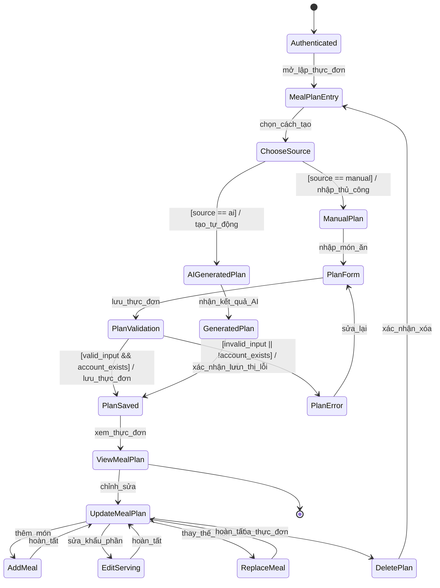
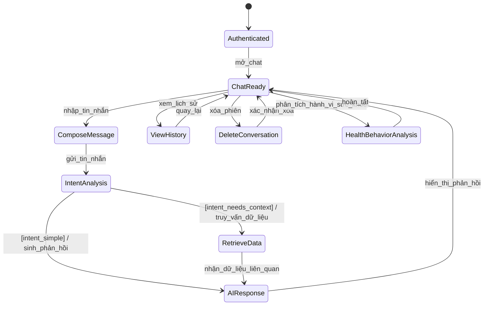
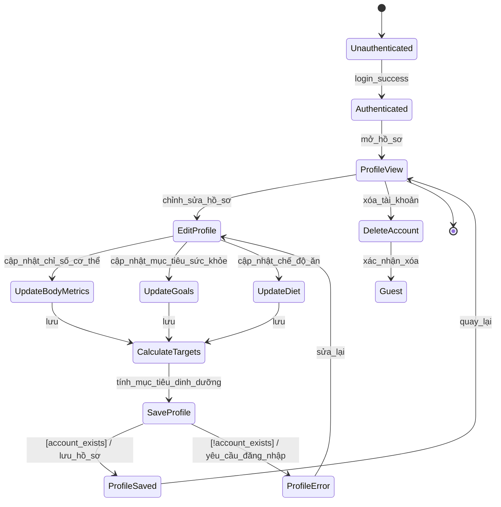
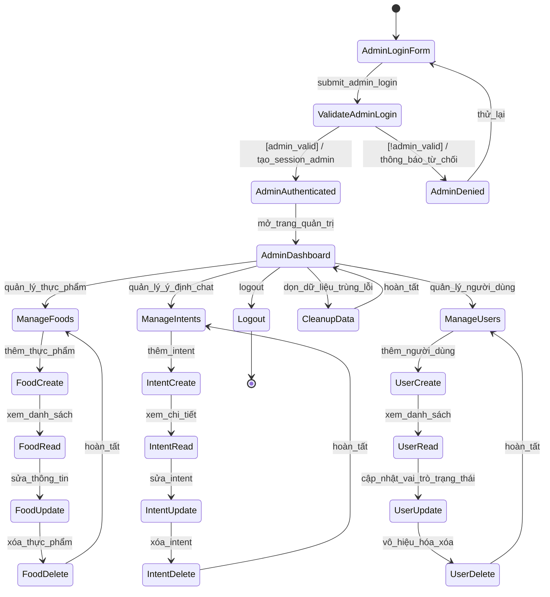

# Sơ đồ trạng thái cho 7 use case lớn

Tài liệu này chuyển 7 use case lớn sang sơ đồ trạng thái theo quy ước đã nêu: một trạng thái khởi đầu, các trạng thái chính, nhánh lựa chọn và các chuyển tiếp có trigger/guard/behavior.

## 1. Xác thực & phân quyền

## 2. Theo dõi dinh dưỡng

## 3. Bảng điều khiển & phân tích

## 4. Lập thực đơn

## 5. Tư vấn chat AI

## 6. Hồ sơ người dùng

## 7. Quản trị dữ liệu

## Ghi chú triển khai

- Các trạng thái `Authenticated` / `AdminAuthenticated` là các trạng thái nền tảng cần được bảo vệ bằng session và quyền truy cập.
- Các nhánh `[...]` thể hiện `Guard` theo quy ước yêu cầu.
- Các hành vi `/ ...` thể hiện `Behavior` khi chuyển trạng thái.
- Nếu muốn, tôi có thể tiếp tục chuyển từng sơ đồ này thành bảng trạng thái chi tiết theo từng màn hình UI hoặc thành file ảnh/PlantUML.
