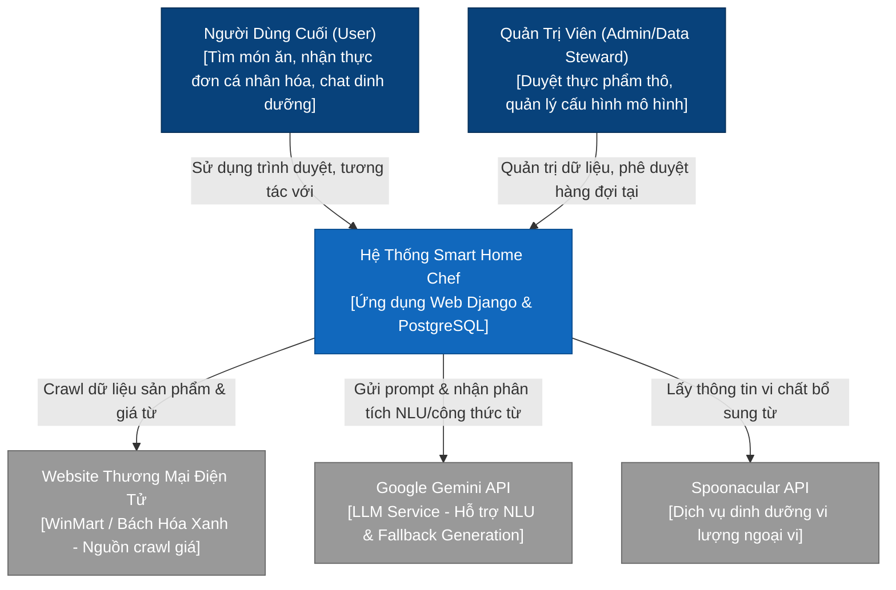
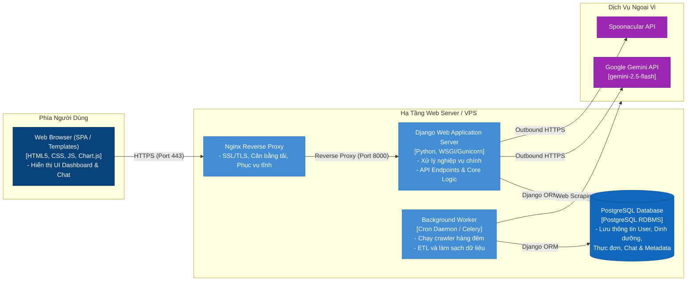
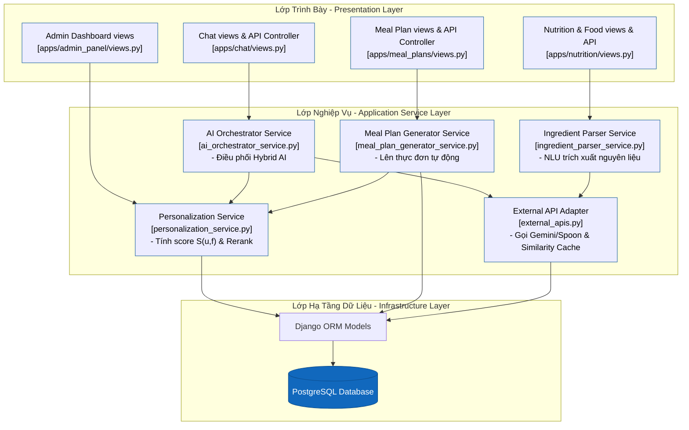
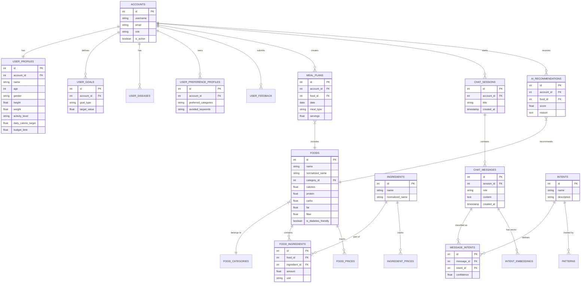
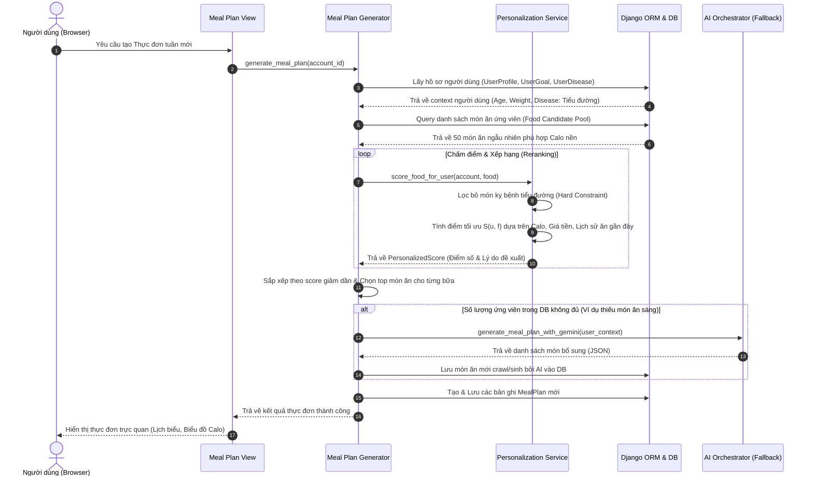

# THIẾT KẾ KIẾN TRÚC TỔNG THỂ HỆ THỐNG (SYSTEM ARCHITECTURE)
## ĐỀ TÀI: NGHIÊN CỨU VÀ PHÁT TRIỂN ỨNG DỤNG WEB TRỢ LÝ NỘI TRỢ THÔNG MINH DỰA TRÊN PHÂN TÍCH DỮ LIỆU VÀ CÁ NHÂN HÓA THỰC ĐƠN SỬ DỤNG DJANGO VÀ POSTGRESQL

Để đồ án tốt nghiệp của bạn đạt tiêu chuẩn kỹ thuật cao, phần kiến trúc hệ thống nên được mô tả bằng **Mô hình C4 (C4 Model)** - tiêu chuẩn công nghiệp hiện đại dùng để trực quan hóa kiến trúc phần mềm theo các mức độ chi tiết khác nhau.

Dưới đây là thiết kế kiến trúc chi tiết từ mức ngữ cảnh (Context), phân rã ứng dụng (Container), chi tiết thành phần bên trong (Component) cho đến sơ đồ quan hệ cơ sở dữ liệu (ERD).

---

## 1. C4 - LEVEL 1: SƠ ĐỒ NGỮ CẢNH HỆ THỐNG (SYSTEM CONTEXT DIAGRAM)

Sơ đồ này mô tả ranh giới của hệ thống **Smart Home Chef**, các tác nhân (User, Admin) tương tác với hệ thống và các dịch vụ bên ngoài (Gemini API, Spoonacular API, Siêu thị WinMart/BHX).

---

## 2. C4 - LEVEL 2: SƠ ĐỒ CONTAINER (CONTAINER DIAGRAM)

Sơ đồ này phân rã hệ thống thành các "Container" chạy độc lập (Web Server, Background Worker, Database, Trình duyệt Web).

---

## 3. C4 - LEVEL 3: SƠ ĐỒ THÀNH PHẦN (COMPONENT DIAGRAM)

Sơ đồ này đi sâu vào kiến trúc bên trong của Container **Django Web Application Server**, chỉ ra cách phân tách các lớp nghiệp vụ theo nguyên lý Clean Architecture.

---

## 4. SƠ ĐỒ QUAN HỆ THỰC THỂ CƠ SỞ DỮ LIỆU (DATABASE ERD)

Dưới đây là sơ đồ ERD mô tả cấu trúc các bảng dữ liệu chính trong PostgreSQL và mối quan hệ giữa các phân hệ: **Users (Hồ sơ người dùng)**, **Nutrition (Dinh dưỡng & Thực phẩm)**, **Meal Plans (Thực đơn)**, và **Chat/AI**.

---

## 5. LUỒNG DỮ LIỆU ĐIỂN HÌNH (DATA FLOW)
### Luồng Đề Xuất Thực Đơn & Cá Nhân Hóa (Meal Plan Generation Flow)

Sơ đồ tuần tự (Sequence Diagram) dưới đây mô tả cách các thành phần phần mềm tương tác với nhau khi người dùng gửi yêu cầu tạo thực đơn.

