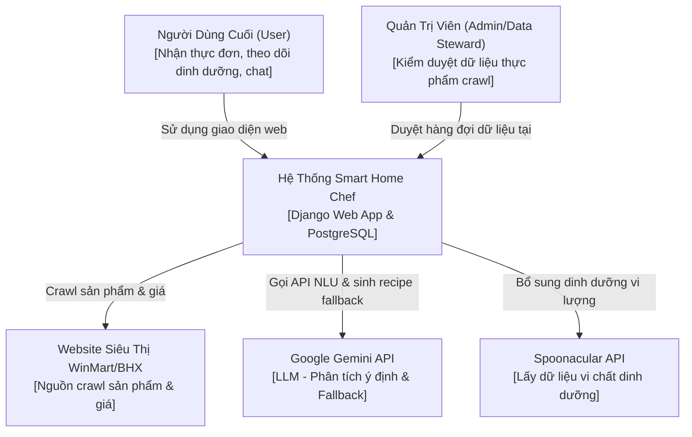
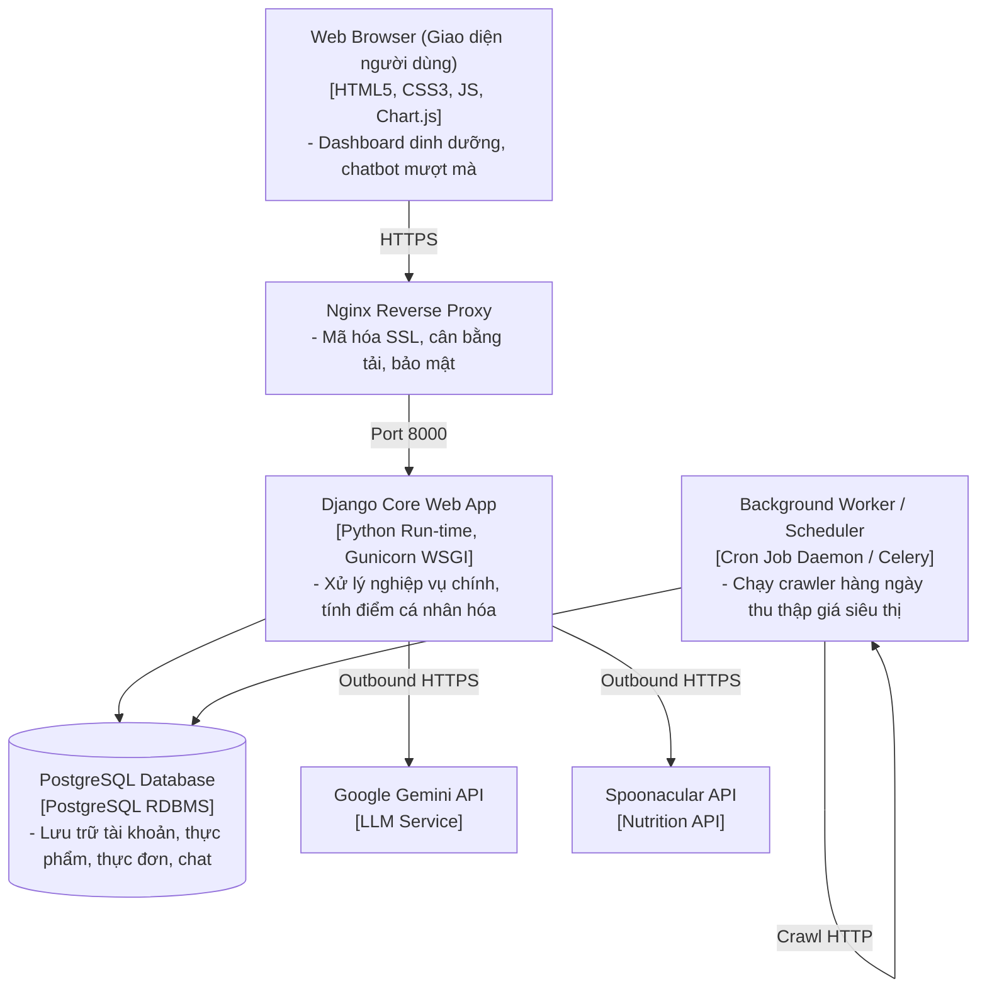

# TỔNG QUAN HỆ THỐNG: KIẾN TRÚC VÀ CÁC CHỨC NĂNG CHÍNH
## ĐỀ TÀI: NGHIÊN CỨU VÀ PHÁT TRIỂN ỨNG DỤNG WEB TRỢ LÝ NỘI TRỢ THÔNG MINH DỰA TRÊN PHÂN TÍCH DỮ LIỆU VÀ CÁ NHÂN HÓA THỰC ĐƠN SỬ DỤNG DJANGO VÀ POSTGRESQL

---

## PHẦN 1: MÔ HÌNH KIẾN TRÚC CHUNG CỦA HỆ THỐNG

Hệ thống **Smart Home Chef** được thiết kế theo kiến trúc phân lớp sạch (**Clean Architecture**) kết hợp cơ chế **Hybrid AI (Trí tuệ nhân tạo hỗn hợp)**: ưu tiên tìm kiếm dữ liệu và xử lý nội bộ tại database (**DB-First**), và chỉ gọi các dịch vụ AI bên ngoài (**LLM Fallback**) khi dữ liệu nội bộ chưa đáp ứng.

### 1. Sơ Đồ Ngữ Cảnh Hệ Thống (System Context)
Mô tả mối quan hệ giữa hệ thống với người dùng và các thực thể ngoại vi:

### 2. Sơ Đồ Triển Khai Container (Container Diagram)
Mô tả các thành phần phần mềm chính và công nghệ vận hành hệ thống:

---

## PHẦN 2: CÁC CHỨC NĂNG CHÍNH CỦA HỆ THỐNG

Hệ thống được tổ chức thành **5 phân hệ chức năng cốt lõi**, đáp ứng trọn vẹn nghiệp vụ hỗ trợ nội trợ thông minh:

### 2.1. Phân Hệ Quản Lý Người Dùng & Thiết Lập Hồ Sơ Cá Nhân (User & Profile Module)
Đảm nhận vai trò thu thập chỉ số sinh học và thiết lập các ràng buộc cá nhân hóa của người dùng.
*   **Đăng ký & Đăng nhập bảo mật**: Hỗ trợ đăng ký tài khoản thường và đăng nhập nhanh thông qua bên thứ ba (Google OAuth2).
*   **Hồ sơ chỉ số cơ thể**: Lưu trữ chiều cao, cân nặng, độ tuổi, giới tính, mức độ vận động hàng tuần.
*   **Tính toán nhu cầu dinh dưỡng tự động**: Tự động tính toán chỉ số BMR (Basal Metabolic Rate) và TDEE (Total Daily Energy Expenditure) để xác định mục tiêu Calo nạp vào hàng ngày phù hợp với mục tiêu sức khỏe (Giảm cân, tăng cơ, giữ cân).
*   **Ràng buộc bệnh lý & Dị ứng**: Cho phép khai báo các bệnh lý nền (Tiểu đường, cao huyết áp, gout, bệnh thận) và các nguyên liệu gây dị ứng để hệ thống tự động lọc bỏ các nguyên liệu nguy hiểm.
*   **Thiết lập ngân sách chi tiêu**: Khai báo giới hạn chi phí đi chợ hàng ngày/hàng tuần để tối ưu hóa giá tiền của thực đơn đề xuất.

### 2.2. Phân Hệ Lập Kế Hoạch & Cá Nhân Hóa Thực Đơn (Meal Planning & Recommendation)
Trái tim thuật toán của đồ án, xử lý phân tích dữ liệu để đề xuất bữa ăn.
*   **Lập thực đơn tự động theo tuần/ngày**: Tự động phân phối món ăn vào các bữa Sáng (30% Calo) - Trưa (40% Calo) - Tối (30% Calo) sao cho tổng calo ngày tiệm cận Calo đích của người dùng.
*   **Thuật toán xếp hạng cá nhân hóa $S(u, f)$**: Chấm điểm món ăn dựa trên sự kết hợp đa mục tiêu: Sở thích danh mục, mục tiêu Calo, hạn mức ngân sách siêu thị, và áp dụng điểm phạt ăn lặp lại (Recency Penalty) để tránh thực đơn nhàm chán.
*   **Lọc ràng buộc cứng (Health Safe Filter)**: Tự động loại bỏ mọi món ăn chứa nguyên liệu kị với bệnh lý nền hoặc chứa chất gây dị ứng đã khai báo trong hồ sơ.
*   **Sinh Shopping List tự động**: Tổng hợp tất cả nguyên liệu cần mua từ thực đơn tuần đã lập, tự động quy đổi đơn vị đo lường và tính toán tổng chi phí ước tính dựa trên giá thực tế của WinMart.

### 2.3. Phân Hệ Trợ Lý AI Chatbot Thông Minh (AI Conversational Assistant)
Giao tiếp tự nhiên bằng tiếng Việt với người dùng về chủ đề dinh dưỡng.
*   **Phân loại ý định chat (Semantic Intent Classifier)**: Tự động nhận diện ý định của người dùng (hỏi thực đơn, tra cứu calo thực phẩm, hỏi công thức nấu ăn, chat tự do) thông qua so khớp từ khóa và tìm kiếm vector tương đồng ngữ nghĩa.
*   **Tạo phản hồi tự nhiên (Generative Fallback)**: Kết nối với Gemini API để giải đáp các câu hỏi dinh dưỡng phức tạp, viết công thức nấu ăn và đề xuất cách thay thế nguyên liệu khi tủ lạnh thiếu đồ.
*   **Bộ đệm tương đồng (Similarity Cache)**: Sử dụng thuật toán Jaccard Similarity để lưu trữ các câu trả lời của AI. Khi người dùng hỏi câu tương tự, hệ thống lấy ngay kết quả trong cache, giảm đến 70% số lượt gọi API Gemini giúp tiết kiệm chi phí vận hành.

### 2.4. Phân Hệ Quản Lý Dữ Liệu Thực Phẩm & Dinh Dưỡng (Nutrition & Food Management)
Quản trị kho dữ liệu thực phẩm, nguyên liệu và thông tin dinh dưỡng.
*   **Crawl dữ liệu sản phẩm & Giá thực tế**: Tự động lấy thông tin tên sản phẩm, danh mục, hình ảnh và giá cả từ siêu thị lớn (WinMart/Bách Hóa Xanh).
*   **Làm giàu dinh dưỡng**: Tự động gọi API Spoonacular để phân tích và điền các chỉ số dinh dưỡng (Calories, Carbs, Protein, Fat, Xơ) đối với sản phẩm mới crawl về.
*   **Trích xuất nguyên liệu từ văn bản tự nhiên (Ingredient Parser)**: Chuyển đổi một chuỗi văn bản tự do của người dùng nhập (ví dụ: "tôi có 200g thịt ba chỉ, 2 quả cà chua") thành danh sách nguyên liệu có cấu trúc định lượng rõ ràng.

### 2.5. Phân Hệ Quản Trị & Giám Sát Chất Lượng Dữ Liệu (Admin & Data Governance)
Dành riêng cho Quản trị viên (Admin) và Chuyên gia dinh dưỡng (Data Steward).
*   **Hàng đợi kiểm duyệt thực phẩm (Verification Queue)**: Nơi hiển thị các thực phẩm mới crawl từ siêu thị. Cho phép Admin phê duyệt đưa vào sản xuất, sửa thông tin dinh dưỡng hoặc hợp nhất (merge) các sản phẩm trùng lặp.
*   **Audit Logging**: Lưu vết chi tiết lịch sử cập nhật thực phẩm, ai đã duyệt món ăn nào, thay đổi những gì để đảm bảo khả năng khôi phục dữ liệu khi xảy ra lỗi.
*   **Giám sát hiệu năng AI**: Biểu đồ thống kê số lượt gọi API Gemini, chi phí tiêu thụ, và tỷ lệ cache hit-rate của hệ thống.
